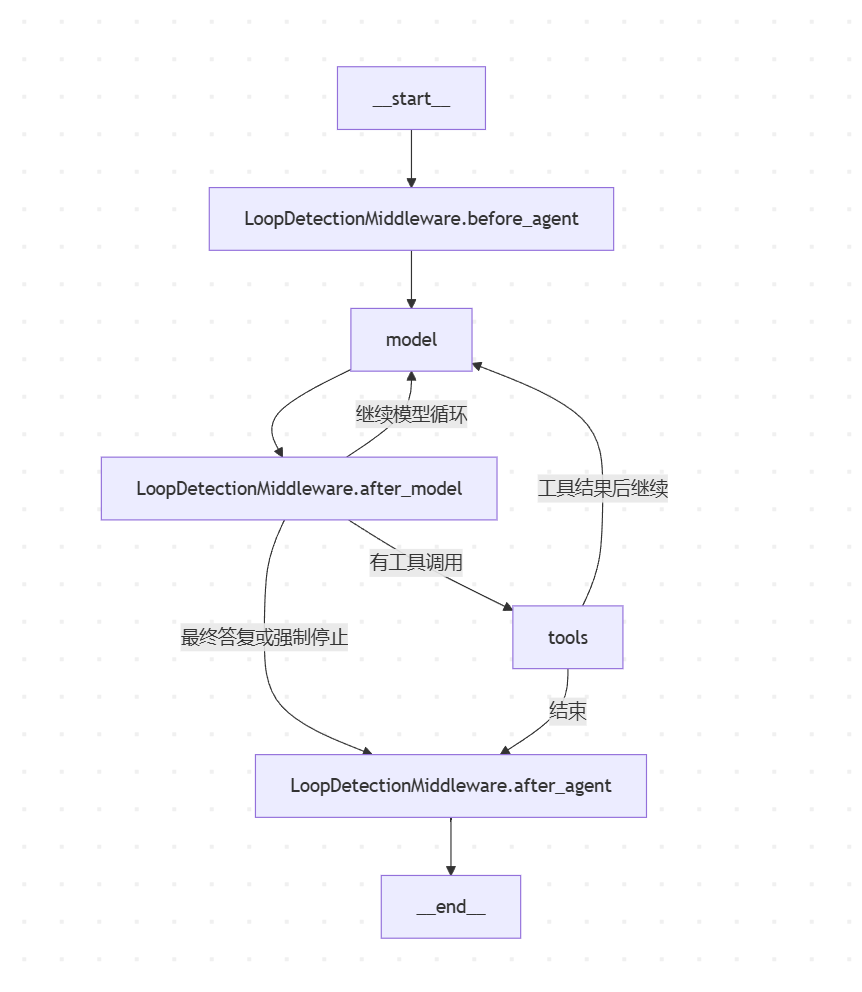

面试官下午好，我叫蔡澈，本科毕业于三峡大学土木工程专业，硕士毕业于华南理工大学智能建造专业，研究方向主要是深度学习、计算机视觉在建筑领域的应用。现就职于中建科创斯维尔公司。在公司我主要从事模型训练数据集构建、大模型微调与部署以及 agent 开发相关工作。

- 一个是 基于deepspeed 通过lora微调开源多模态大模型 LISA，实现施工场景的开放语义分割。主要解决了抽象语义标签难分割问题，并基于开源模型构建了高效的自动化数据标注流程，降低人工标注成本。
- 第二个是企业内部工时管理助手，用于企业估算各个项目的人力成本，主要用户是公司普通员工及管理人员，我独立负责 agent 开发工作，已经落地上线使用。
- 第三个是建筑成本预算 agent 开发，主要面向的用户是估算建筑成本的造价员，我参与架构设计，并搭建 harness 基础设施、构建 benchmark 等，目前还在持续开发中。

我看了 JD 要求，觉得恰好与我过往积累的经验契合，希望能加入贵公司共事。

#  Harness基础设施搭建：支持细分场景意图分流，实现Skill/Tool渐进加载、中间件观测/干预、执行链路追踪、用户沙箱隔离与IM

- 如何支持细分场景意图分流？怎么做的？
采用的是“Lead Agent + 强约束路由表”，不是单独部署一个意图分类模型:
系统提示词把业务拆成多个场景，每个意图绑定明确动作。
路由质量不依赖模型“自述自己识别了什么意图”，而是检查第一次决策实际调用了哪个工具。L1 benchmark 会读取 tool-call 轨迹，统计路由率、澄清正确率并将结果写入 Langfuse。仓库也明确说明当前“没有独立路由代码”，见benchmark/L1_routing/README.md:12。
因此它的特点是：扩展业务场景比较快，但路由稳定性依赖提示词、模型工具调用能力和持续评测。如果要求完全确定性，可以再在 Lead Agent 前增加规则/分类器预路由，模型只处理歧义请求。

- 如何实现skill/tool的渐进加载，有哪些skill/tool？
  1. skill ：系统提示词有一套skill系统，向llm声明了有哪些skill，当用户的意图与skill相匹配时，会调用read_file工具，读取skill文件夹中的使用说明。
  - skills/public/cost-workflow-guide/SKILL.md：完整组价 workflow 的启动、逐闸确认和恢复操作规范。
  - skills/public/norm-qa/SKILL.md：深圳·2013 口径的造价规范问答，要求先检索并用 verify_norm 回查。
  
  2. tool：工具太多时，模型幻觉率提升，因此对于 mcp 工具，采用延迟加载，具体策略如下：在系统提示词中配置 tool_search 工具，该工具 schema 中明确了延迟工具在系统提示词中已枚举，且接受一个查询参数，tool_search 内部通过关键词命中返回 mcp工具的完整 schema，promote后下一轮模型就对该工具可见。
  
- 为什么接入IM，IM怎么接入的？
  为了以后更方便收集用户需求。
  我接入了微信个人和企业机器人版。在项目中我做了一个 IM adapter层。对于不同的IM，统一消息出入口：
  @dataclass
  class InboundMessage:
      channel_name: str   # wechat / feishu / slack
      chat_id: str        # 平台会话 ID
      user_id: str        # 平台用户 ID
      text: str           # 用户文本
      msg_type: str       # chat / command
      thread_ts: str | None
      files: list[dict]   # 附件
      metadata: dict      # 平台特有信息

    我们的业务服务（WechatChannel）──主动请求──> 微信 iLink 服务 <──等待并返回── 微信用户消息
    首次认证，扫码或从微信开发者平台获取token，以后每次请求带。
    我们发起长轮询，每隔 35s 拨号一次，35内收到消息马上回复，否则挂了再打

- 怎么做用户沙箱隔离的
  假设用户 Alice 正在会话 chat-101 中，让 Agent 创建一个文件：
  write_file({
    "path": "/mnt/user-data/workspace/todo.txt",
    "content": "buy milk"
  })
  面试时可以这样讲：
  > 这里 Agent 传入的是虚拟路径，不是真实服务器路径。服务端已经通过登录态确定当前用户是 Alice，并从请求上下文拿到当前会话 ID chat-101。这两个身份信息不由模型决定。
  >
  > ThreadDataMiddleware 据此为这次会话确定唯一的真实目录：
  >
  > .deer-flow/users/alice/threads/chat-101/user-data/
  > ├─ workspace/
  > ├─ uploads/
  > └─ outputs/
  >
  > 第一次调用沙箱工具时，系统创建这些目录并初始化该线程的 local:chat-101 沙箱映射。
  >
  > 接着 write_file 检查模型传入的路径。/mnt/user-data/workspace/todo.txt 属于允许写入的 user-data 区，所以通过；如果模型传的是 /etc/passwd、/mnt/skills/x.md，或者 /mnt/user-data/workspace/../../bob/
  > secret.txt，都会直接被拒绝。
  >
  > 通过后，系统把虚拟路径转换为真实路径：
  >
  > /mnt/user-data/workspace/todo.txt
  > ↓
  > .deer-flow/users/alice/threads/chat-101/user-data/workspace/todo.txt
  >
  > 然后它会对真实路径执行规范化解析，并再次确认这个路径仍在 chat-101 的 workspace、uploads 或 outputs 目录中。比如 workspace 里有一个软链接指向其他目录，解析后的路径如果跑到了 Alice 当前会话目录外，也会被拒
  > 绝。
  >
  > 最后系统对这个文件加锁，再写入内容。
  结果是：
  .deer-flow/users/alice/threads/chat-101/user-data/workspace/todo.txt

  Alice 的 Agent 无法通过 write_file 直接写入：
  .deer-flow/users/bob/threads/chat-202/...
  D:\Windows\...
  /etc/...
  一句话总结：
  > Agent 只提交虚拟路径；服务端用可信的用户和会话上下文决定真实目录；写入前做虚拟路径授权，映射后再做真实路径边界校验，最终将文件限制在当前用户的当前会话目录内。

- 项目基于 langgraph 开发,架构如下：
   
  
- 工具层：
  当前默认 lead agent（subagent_enabled=False、默认 qwen3-32b）实际加载了 18 个工具：
  分类如下：
  - 造价：前 10 个 cost_*、bill_match、quota_recommend、price_query、校验工具。
  - 沙箱文件与命令：ls、read_file、glob、grep、write_file、str_replace、bash。
  - 内置交互：present_files、ask_clarification
  当前配置还启用了 ce-rag 和 ce-db 两个 MCP 服务，并启用了 tool_search。当 MCP 工具缓存成功加载时，lead agent 会额外获得 tool_search，MCP 工具本身先处于 deferred 状态，必须先搜索并提升后才能调用。

- create_agent(...) 对比手搓
  create_agent(...) 是 LangChain 提供的“标准 Agent 图工厂”；手动 StateGraph + compile() 是自己定义图。
  
  1. create_agent 的写法
  agent = create_agent(
      model=model,
      tools=tools,
      middleware=middlewares,
  )
  它在内部已经替你完成了大部分图定义与 compile()：
  START → before_agent hooks → before_model hooks → model
  model → after_model hooks
  after_model → tools / 下一轮 model / after_agent
  tools → before_model hooks / after_agent
  after_agent hooks → END
    你只需提供模型、工具和中间件；工具调用循环、条件路由、ToolNode、消息状态合并等都由框架按约定生成。DeerFlow 当前属于这种方式。

  1. 手动定义则是：
  from langgraph.graph import StateGraph, START, END
  graph = StateGraph(State)
  graph.add_node("planner", planner)
  graph.add_node("search", search)
  graph.add_node("writer", writer)
  graph.add_edge(START, "planner")
  graph.add_conditional_edges(
      "planner",
      route,
      {"search": "search", "writer": "writer"},
  )
  graph.add_edge("search", "planner")
  graph.add_edge("writer", END)
  agent = graph.compile()
  这时节点、边、条件和状态流转都由你决定，例如可实现：
  START → classify → cost_workflow / rag_workflow / direct_answer → END

 

- 结合本项目，简要回答agent和harness区别，比如哪些是agent范畴，哪些是harness
  在本项目里，可以用一句话区分：Agent 决定“做什么、先做什么、调用什么”；Harness 提供“让它能安全、可控、可追踪地做完”
   范畴       本项目中的内容
  ━━━━━━━━━  ━━━━━━━━━━━━━━━━━━━━━━━━━━━━━━━━━━━━━━━━━━━━━━━━━━━━━━━━━━━━━━━━━━━━━━━━━━━━━━━━━━━━━━━━━━━━━━━━━━━━━━━━━━━━━━━━━━━━━━━━━━━━━━━━━━━━━━━━━━━━━━━━━━
   Agent      lead_agent 主智能体、general-purpose/bash 等 sub-agent；系统提示词中的意图判断、任务拆解、工具选择、结果综合；task 委派逻辑
  ─────────  ──────────────────────────────────────────────────────────────────────────────────────────────────────────────────────────────────────────────────
   Harness    LangGraph 运行时、模型工厂、Tool 注册与 MCP、Skill 加载、Middleware、中断/恢复、Checkpointer、RunManager、Sandbox、Tracing、Token 统计、错误恢复
  ─────────  ──────────────────────────────────────────────────────────────────────────────────────────────────────────────────────────────────────────────────
   应用层     Gateway API、用户认证、IM Channel（飞书、Slack、微信等）、业务领域工具，如造价的 bill_match、price_query、cost_workflow

  具体来说：
  - Agent 的核心是决策循环：模型输出 → 是否调用工具 → 执行结果回传 → 再决策。例如 lead_agent 根据提示词把“规范问题”路由到 tool_search/ce-rag，把“选清单编码”路由到 bill_match。
  - Harness 不决定业务答案，而是负责把工具、Skill、沙箱和执行状态组织起来。例如 DeferredToolFilterMiddleware 隐藏未加载的 Tool Schema，GuardrailMiddleware 在工具执行前拦截，LoopDetectionMiddleware 防止死循环。
  - Sandbox、用户目录隔离、文件映射、Docker 容器、Langfuse/LangSmith Trace、RunJournal、SSE 流式输出，全部属于 Harness 能力。
  - Skill 介于两者之间：Skill 内容是领域流程知识，属于 Agent 的“可加载认知”；但 Skill 的发现、启用、读取和缓存机制属于 Harness。
  - app/ 下的 Gateway 和 IM 不是核心 Agent，而是应用接入层；packages/harness/deerflow/ 才是可复用的 Harness 包。
  在代码结构上，边界也很明确：
  - Agent：backend/packages/harness/deerflow/agents/lead_agent
  - Harness：backend/packages/harness/deerflow/runtime、backend/packages/harness/deerflow/agents/middlewares、backend/packages/harness/deerflow/sandbox、backend/packages/harness/deerflow/tools、backend/packages/harness/deerflow/skills
  - 应用层：backend/app/gateway、backend/app/channels
  因此，换模型、换业务提示词、增加一个子智能体，主要改 Agent；增加新的安全策略、沙箱后端、追踪系统、Tool/MCP 扩展，主要改 Harness。

- Skill/Tool渐进加载
  Skill 是“渐进加载知识和工作流”：
  - 启动时扫描 skills/public、skills/custom 下的 SKILL.md。
  - 系统提示词只注入 Skill 的名称、描述和文件路径，不注入完整正文。
  - 模型判断场景命中后，用 read_file 读取对应 SKILL.md。
  - Skill 引用的脚本、模板、references 再根据执行需要二次加载。
  这避免几十个 Skill 全量占用上下文。实现入口见 backend/packages/harness/deerflow/agents/lead_agent/prompt.py:610。

  Tool 是“渐进暴露调用 Schema”：
  - 核心工具直接绑定。
  - MCP 工具先注册到 DeferredToolRegistry，执行节点持有完整工具，但模型侧暂时看不到参数 Schema。
  - 系统提示词只列出 deferred tool 名称。
  - 模型先调用 tool_search；命中后返回完整 OpenAI function schema，并将工具从 deferred 状态提升为 active。
  - 后续模型轮次才真正看到并调用该工具。
  注册与 promotion 在 backend/packages/harness/deerflow/tools/builtins/tool_search.py:39，Schema 隐藏和未提升调用拦截在 backend/packages/harness/deerflow/agents/middlewares/
  deferred_tool_filter_middleware.py:26。

- 中间件观测/干预
    Agent 通过 LangChain/LangGraph Middleware hooks 构成执行管道，主要挂在：
  - before_agent：建立 thread 目录和运行上下文
  - before_model：注入动态上下文、图片、摘要
  - wrap_model_call：修复消息历史、过滤工具、处理模型异常
  - after_model：检查循环、限制并发子任务、生成标题
  - wrap_tool_call：Guardrail、审计、异常恢复、HITL 中断
  - after_agent：记忆更新、沙箱释放
  典型干预包括：
  - Guardrail 在工具执行前允许/拒绝调用，支持 fail-closed。
  - SandboxAudit 对 shell 命令分级，危险命令直接拦截。
  - DeferredToolFilter 禁止绕过 tool_search 调用隐藏工具。
  - ToolErrorHandling 把异常转成 ToolMessage，避免整条链路崩溃。
  - LoopDetection 识别重复调用并强制停止。[graph图节点]
  - Clarification 拦截澄清工具，通过 Command(goto=END) 暂停等待用户。

- 执行链路追踪
  一次请求被抽象为 thread → run → graph nodes → model/tool calls：
  - RunManager 创建后台 run。
  - run_agent() 装载 checkpointer、runtime context、callback 和 agent graph。
  - LangGraph astream() 持续输出 values、updates、messages 等事件，通过 StreamBridge 转成 SSE。
  - Checkpointer 保存会话状态，支持多轮继续、中断和 rollback。
  - RunJournal 通过 LangChain callbacks 记录 run start/end、LLM 请求响应、tool result、token usage、耗时和调用方。
  - 本地事件可落 JSONL/数据库；外部同时支持 LangSmith 和 Langfuse。
  入口见 backend/packages/harness/deerflow/runtime/runs/worker.py:124，事件记录见 backend/packages/harness/deerflow/runtime/journal.py:38。
  追踪元数据包括：
  - session_id = thread_id
  - user_id
  - assistant/agent 名称
  - 模型名称
  - 环境
  - Prompt variant
  Langfuse trace id 由 run_id 确定性派生，所以用户反馈可以事后准确回写到原 trace，形成“线上反馈 → score → dataset/eval”的闭环。元数据注入见 backend/packages/harness/deerflow/tracing/metadata.py:125。

- 用户沙箱隔离
  隔离键是 user_id × thread_id。每个会话拥有独立目录：
  .deer-flow/users/{user_id}/threads/{thread_id}/
  ├── user-data/
  │   ├── workspace/
  │   ├── uploads/
  │   └── outputs/
  └── acp-workspace/
  Agent 统一看到虚拟路径 /mnt/user-data/...，不知道宿主机真实路径。路径解析会校验前缀、分段边界和目录穿越，见 backend/packages/harness/deerflow/config/paths.py:171。
  支持两种实现：
  - LocalSandboxProvider：把虚拟路径映射到每个 thread 的宿主机目录；默认关闭 host bash。它提供文件隔离，但不是强安全边界。
  - AioSandboxProvider：为 thread 分配 Docker/Kubernetes 容器，并挂载该 thread 的 workspace/uploads/outputs，适合不可信代码执行。
  本地实现见 backend/packages/harness/deerflow/sandbox/local/local_sandbox_provider.py:34，
  容器实现见 backend/packages/harness/deerflow/community/aio_sandbox/aio_sandbox_provider.py:108。

- IM 接入
  IM 层采用 Adapter + MessageBus + ChannelManager：
  1. 飞书、企微、微信、Slack、Telegram、Discord、钉钉适配器把平台消息转换成统一 InboundMessage。
  2. MessageBus 解耦平台 SDK 与 Agent 调度。
  3. ChannelStore 保存 channel + chat_id + topic_id → DeerFlow thread_id 映射，实现连续会话。
  4. ChannelManager 通过 Gateway 内部认证调用 runs.wait 或 runs.stream。
  5. Agent 返回文本和 present_files 产物。
  6. Manager 只允许发送 /mnt/user-data/outputs 下的文件，再交给对应平台上传或流式更新卡片。
  统一消息总线见 backend/app/channels/message_bus.py:117，核心调度见 backend/app/channels/manager.py:746，Channel 生命周期和动态加载见 backend/app/channels/service.py:55。
  需要注意一个现状：Web/API 请求已经按认证用户做 user_id × thread_id 隔离；IM 内部调用目前使用合成的 default 用户，IM 会话主要依靠不同 thread_id 隔离。如果要做严格的企业 IM 多租户，还应把平台 tenant/user
  映射成独立的 runtime user_id。

# 从零搭建分层Benchmark：按路由、检索、忠实性等维度分层建设数据集与评测 Runner，建立交互快验....
这个项目的核心不是“写了几个评测脚本”，而是把 Agent 的运行过程拆成可独立测量的层，再用统一数据、Runner 和 Trace 把“发现问题—修改—回归”闭环起来：

  单条快验 → 批量 Runner → 程序化打分 → Langfuse Trace 归因
      ↑                                           ↓
      └──────── 金标校准 / Prompt 调优 / 阈值调整 ────────┘

## 一、Benchmark 怎么分层

  总体规范在 benchmark/AGENT_BENCHMARK.md，目录映射在 benchmark/README.md:5。

   层                  测量对象                    主要指标
  ━━━━━━━━━━━━━━━━━━  ━━━━━━━━━━━━━━━━━━━━━━━━━━  ━━━━━━━━━━━━━━━━━━━━━━━━━━━━━━━━━━━━
   L1 路由             第一次该调用什么能力        路由率、反问正确率、危险误分
  ──────────────────  ──────────────────────────  ────────────────────────────────────
   L2 门控             自动定稿还是转人工          自动定稿准确率、高置信错码、覆盖率
  ──────────────────  ──────────────────────────  ────────────────────────────────────
   L3 检索             金标是否进入候选            Recall@k、Top-1、版本/地域正确性
  ──────────────────  ──────────────────────────  ────────────────────────────────────
   L4 红线             是否越界、编造、错误取数    红线违规率、拒答正确率
  ──────────────────  ──────────────────────────  ────────────────────────────────────
   L5 复合请求         子任务拆解是否完整          子任务 P/R/F1
  ──────────────────  ──────────────────────────  ────────────────────────────────────
   L6 Agent outcome    最终任务是否做成            pass^k、工具调用正确率、忠实性
  ──────────────────  ──────────────────────────  ────────────────────────────────────
   L7 NFR              系统工程指标                P95 延迟、隔离性、可观测性

  这样做的价值是：端到端失败后，能判断究竟是路由错、召回不到、候选选错，还是答案编造，而不是只得到一个无法行动的总分。

  当前仓库中 L1、L3 和 L6 的 cost/toolcall/faithfulness Runner 已可执行；L4、L5、L7 部分仍是数据或设计占位，所以对外介绍时适合说“完成核心层并建立可扩展的七层框架”，不宜说七层已经全部自动化。

## 二、数据集是怎么建设的
### 1. 路由数据
  主池在 benchmark/L1_routing/data/user_requests.jsonl，共78条：
  - 54条明确、标准问法；
  - 24条口语和模糊问法；
  - 覆盖规范问答、清单选码、定额推荐、询价、计算、整单组价和域外请求；
  - 每条带 capability、difficulty、group、expect_route、expect_clarify。
  例如，“钢筋现在什么价”应该调 price_query；“这面墙组个价”因为对象信息不足，应先 ask_clarification；“上海本月钢筋信息价”属于他省口径，应拒绝取数。
  另外还有90条清单选码专项集 benchmark/L1_routing/data/bill_match_routing.jsonl。它不是纯 LLM 编造，而是从真实2013清单金标中抽取项目特征，再套确定性问法模板生成，降低合成数据失真。

### 2. 检索和任务级数据
  - L3 清单检索：91条2013版描述→9位金标编码。
  - L6 cost task：10条完整组价任务。
  - L6 toolcall：16条工具名和参数金标。
  - L6 faithfulness：8条规范问答，包含 gold_contexts、gold_answer_points 和拒答边界。
  - 另有8条多轮轨迹、6条故障注入数据，Runner 尚待补齐
  数据通过 benchmark/_shared/upload_datasets.py 幂等上传到 Langfuse Dataset。稳定 ID 保证重复上传是更新而不是制造重复样本。

## 三、Runner 怎么做到可复现
  路由核心实现在 benchmark/L1_routing/run_routing_experiment.py:111。
  每条用例的执行过程是：
  1. 从 Langfuse Dataset 拉取 query 和期望输出。
  2. 创建带随机后缀的独立 thread_id，防止复用旧 checkpoint。
  3. 用 DeerFlowClient.stream() 执行 Agent。
  4. 只读取第一条 AI 决策中的 tool_calls。
  5. 捕获后立即停止，不真正执行下游工具。
  6. 对照金标程序化判分。
  7. 将 route_correct、clarify_correct 和对应 Trace 关联到 Dataset Run。
  “只看第一次决策”是一个重要设计：路由层只回答“第一步选对没有”。如果完整执行，后续知识服务异常、上下文溢出、工作流打转都会被误算成路由错误。
  路由发生的判据不是模型自述“我判断这是询价”，而是外部行为
  did_route = tool_name in {
      "bill_match",
      "quota_recommend",
      "price_query",
      "cost_calc",
      "cost_workflow_start",
      "tool_search",
      "ce-rag_search_clause",
      "verify_norm",
      ...
  }
  如果应该先反问，并且模型调用了 ask_clarification，这条用例会正确停止等待用户，不会因为“尚未进入后续路由”被冤判失败，相关处理在 benchmark/L1_routing/run_routing_experiment.py:221。
  为避免评测污染，还做了两层隔离：
  - 每条用例使用全新 thread；
  - 评测环境关闭跨会话 Memory，避免前一个 variant 的经验污染后一个 variant。

## 四、三个评测闭环怎么落地
### 1. 交互快验
  日常先用 backend/debug.py 手工跑3～5条典型 query，秒级观察 Agent 的工具调用；需要经过认证、Gateway、SSE 或多轮续跑时，再用 benchmark/_shared/probe_gateway.py。
  目的不是出正式分，而是快速排除明显错误，避免每改一句 Prompt 都跑完整数据集。

### 2. 批量出
  典型命令：
  uv run --project backend python \
    benchmark/L1_routing/run_routing_experiment.py \
    --run-name v6-2
  Runner 输出逐条结果和聚合指标，同时把分数写回 Langfuse：
  - 路由：route_correct
  - 反问：clarify_correct
  - 检索：recalled、match_top1
  - 工具调用：tool_correct、call_correct
  - 忠实性：faithfulness、refusal_ok
  - 任务级：task_pass、redline_ok

### 3. Trace 归因
  每条 Agent run 都形成一条 Trace，内部嵌套模型调用、工具参数、结果、耗时和错误。thread_id 被映射成 Langfuse session，Prompt 文件名自动打成 variant:* 标签，实现在 backend/packages/harness/deerflow/tracing/
  metadata.py:35。
  失败后按三类归因：
  1. 测量问题：Runner 的工具集合漏了真实工具名。
  2. 环境问题：模型、MCP 或知识服务没启动。
  3. Agent 真错误：模型自答、选错工具、过度反问或违反红线。
  只有第三类才进入 Prompt 调优，避免用提示词掩盖基础设施和评测口径问题。

## 五、召回率和忠实性怎么量
### 检索
  benchmark/L2_gating/select_eval/tools/eval_select.py:35 将检索和选码拆开
  - Recall@k：金标编码是否出现在候选 Top-k。
  - Top-1：最终选中的编码是否等于金标。
  - 候选内 Top-1：只在已召回金标的样本中计算，隔离 LLM 选码能力。
  - 自动定稿准确率：need_review=false 的结果有多少选对。
  - 高置信错码：自动定稿但编码错误，要求为0。
  因此可以区分：
  Recall低                 → 知识库/Embedding/召回策略问题
  Recall高但Top-1低        → 候选排序或LLM选码问题
  Top-1尚可但高置信错码存在 → 门控和置信校准问题
### 忠实性
benchmark/L6_agent/norm_faithful/norm_faithful_score.py 主要量：
  - 回答引用的条款是否真实存在于检索证据；
  - 是否该拒绝时拒绝、该回答时不误拒；
  - 金标答案要点覆盖率；
  - 金标标准号是否被检索回来。
  它解决的是“说的话有没有证据”，与 Recall 解决的“该找的有没有找到”正交。

# 路由层调优：通过提示词工程迭代、数据集校准，路由准确率从 85% 提升至 98%

## 六、路由从85%到约98%是怎么调出来的

  完整复盘在 benchmark/prompts/prompt_engineering.md:81。

   阶段              路由分数    核心动作
  ━━━━━━━━━━━━━━━━  ━━━━━━━━━━  ━━━━━━━━━━━━━━━━━━━━━━━━━━━━━━━━━━━━━━━━━━━━━━━━━━━━━━━
   金标修正后基线         85%    承认零特征请求先反问是合理行为
  ────────────────  ──────────  ───────────────────────────────────────────────────────
   v5                     89%    规范题强制第一步 tool_search；只写真实工具名
  ────────────────  ──────────  ───────────────────────────────────────────────────────
   v6-1                95.65%    精确区分版本/地区越界与普通国标条文题；补拒答禁编红线
  ────────────────  ──────────  ───────────────────────────────────────────────────────
   v6-2                 约98%    修正一条2024版边界样本的错误金标

  几个关键调优点：
  - 把隐式要求改成不可跳步骤：规范问题必须先检索，拿到证据前不回答。
  - 工具名与运行时注册名完全一致，避免8B把 norm-qa skill 幻觉成一个工具。
  - 给反问规则补反例：材料已经点名的询价直接 price_query，不能因为语言口语化就反问。
  - 精确枚举红线范围，避免弱模型把“2024/他省不支持”泛化成“任何陌生规范都不检索”。
  - 工具报错、零召回时宁可明确拒答，也不能改调其他工具或编造答案。
  
  其中最典型的是 GB50011 用例：Trace 显示模型跳过检索并编造标准号。v6让它先走 tool_search，v7又补上“工具失败也禁止硬凑”的红线。当前生产配置已经切到 benchmark/prompts/lead_agent_v7.yaml，由 config.yaml:249
  热加载。

  > 我们把路由问题当成一个可评测的分类问题，而不是只靠感觉改 Prompt。先修正错误标注，再用固定测试集回归，每次只改一类失败模式；最终路由准确率从 85% 提升到约 98%。
  具体分四步
  1. 先校准数据
  > 一开始发现部分“零特征请求”被标为必须路由，但实际上用户连对象都没说清，正确行为应该是澄清。因此先修正金标，得到可信的 85% 基线。
  2. 让关键路径不可跳过
  > 对规范类问题，不能让模型直接凭知识回答，所以 Prompt 改成硬规则：先 tool_search 找到检索工具，再检索，拿到证据才能回答。这个阶段提高到约 89%。
  3. 补边界和反例
  > 主要错误来自弱模型过度泛化。例如“2024 版、外省口径不支持”被误理解成“陌生规范都不能查”。我把边界写精确：只拒绝明确超出产品支持范围的版本和地区，普通国标条文仍可检索。
  > 同时补反例：用户已经明确材料名称和诉求时，直接调用 price_query，不能因为表达口语化就多余反问。这个阶段到 95.65%。
  4. 工具名和失败策略对齐运行时
  > Prompt 中只写运行时真实注册的工具名，避免模型把 skill 名称误当工具调用。工具报错或检索无结果时，规定“明确说明无法获得依据”，不能偷偷改调别的工具，更不能编答案。
  > 最后发现一条 2024 版边界样本本身金标错误，修正后约 98%。
  最后用一句话收束：
  > 提升不是单纯把 Prompt 写长，而是“正确金标 + 失败样本归因 + 明确动作规则 + 每轮回归评测”。而且这个 98% 指的是路由是否正确，不等同于最终业务答案的正确率。

## 七、两个需要准确表述的地方

  第一，仓库文档写的是97.78%，但已提交的 run_v6_2.log 实际是43/44，即97.73%。由于8B有随机性且每轮“正确止步反问”的数量会变化，简历写“约98%”最稳妥；正式报告应附 run 名、数据版本、模型和分母。

  第二，这里的聚合 route_rate 严格说是“应路由且已到路由环节的样本中，成功触发路由工具的比例”，不是传统多分类准确率。面试时最好说：在冻结路由主池、Qwen3-8B、第一次工具决策口径下，路由触发正确率由85%提升到约98%。

  一句话面试版可以这样讲：
  我把 Agent 按路由、门控、检索、红线和任务终态拆成分层 Benchmark，金标统一灌入 Langfuse；开发时先单条交互快验，再由 Runner 批量执行并程序化挂分，失败样本通过完整工具 Trace 归因。路由层基于第一次工具决策判分，通过金标校准、强制检索硬闸、真实工具名约束和边界红线精确化，将 Qwen3-8B 的路由指标从85%提升到约98%。
