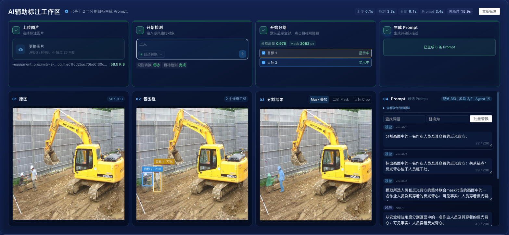

**这个项目主要解决  建筑工地施工现场一些复杂场景的理解问题，支撑下游任务落地。输入是 一段prompt 和 图片，输出分割结果图片。我个人负责数据集构建、模型微调和 api  接口部署。整个链路中最困难的问题是高质量数据集的构建与抽象语义的识别问题。对于前者我基于开源模型设计了自动标注 pipeline 来提升效率，对于后者，我通过badcase分析、优化prompt来提高分割效果。这个项目属于企业科研项目，可以为 agent 提供核心能力：比如施工现场进度识别、安全风险识别等。**

# 数据集构建：设计并落地基于大模型的半自动标注数据流水线，新场景数据构建效率提升约40%



### 678. GroundingDINO、SAM、Qwen3 在流水线中分别负责什么？三个模型的调用顺序和中间数据格式是什么？Qwen3 是纯文本模型还是视觉模型？具体承担 Prompt 生成、标签生成还是结果审核？

**pipeline链路：标注人员上传图片和检测目标名称，系统首先查业务字典翻译为英文，查不到就降级使用qwen3翻译为英文，英文prompt 和 图片 作为 grounding dino 输入，得到不同置信度的包围框，以包围框为prompt，输入 sam 生成掩码，再将带掩码的图片给 qwenvl 得到多个prompt，标注人员自己结合图片掩码质量勾选或自定义prompt，上传到后台**
Qwen3 承担prompt生成

### 9. GroundingDINO 输出的 box 如何传给 SAM？多个 box 和多个 mask 如何处理？

### 10. 如何把自然语言标签映射为 GroundingDINO 能识别的类别或 Prompt？

- 场景字典，安全衣、安全帽统一映射为 helmet
- 翻译工具

### 11. 低置信度、漏检、重复框和错误 mask 如何处理？

人工审核决定提交标注还是放弃

### 12. 哪些样本进入人工审核？是否设计了置信度阈值或主动学习策略？

包围框和掩码置信度分数满足阈值要求的，**阈值是？**

### 13. 人工审核支持哪些操作：确认、修改 mask、重画还是退回？

确认提交标注、放弃标注

### 14. “效率提升 40%”如何计算？对照组、样本量和统计周期是什么？

通过标注人员填报的工时

### 15. 自动标注质量如何衡量？使用 IoU、审核通过率还是平均修改时长？

人工审核通过率

### 16. 如何划分训练集、验证集和测试集，避免同一视频相邻帧造成数据泄漏？

标注平台本身不划分，且不支持视频

### 17. 如何处理类别不平衡、重复图片、模糊图片和错误标注？

标注平台不负责处理这些，错误标注由标注人员兜底，保证可追溯

### 18. 数据和标注是否做版本管理？模型、Prompt、阈值能否追溯？

### 19. GroudingDINO 推理时有哪些超参数？

- short_side = 800:图像预处理，控制图像短边长度，增大有利于处理小目标，但会增加显存占用
- max_size = 1333：限制缩放后图像最长边，增大有利于保存更多细节，但会增加显存占用
- box_threshold = 0.35，判断一个检测框是否保留
- text_threshold =  0.25， 决定哪些 Prompt token 组成检测框的 phrase，调低可能拼入无关词；调高可能导致多词类别不完整

```text
一个 Query 预测一个框（这个 query  不是prompt）
      ↓
得到该框对 Prompt 每个 token 的匹配分数（bert分词）
      ↓
max(token 分数) > box_threshold？
      ↓ 是
保留该框
      ↓
选择 token 分数 > text_threshold 的词
      ↓
把这些词拼成 phrase/entity
```

因此两个阈值的职责不同：决定框是否保留、决定这个框叫什么

产物：包围框对象列表，每个包围框有以下信息：位置坐标，匹配到的phrase及对应得分

### 20. sam

- masks.shape：[box_count, candidate_count, height, width]，scores.shape：[box_count, candidate_count]。
  框数量，每个框生成的掩码数量，掩码尺寸（0|1）每个包围框选得分最高的候选mask。

- 用下面的函数将掩码转换为多边形，多边形点数没有具体控制。
    ```python
    contours, _ = cv2.findContours(
      mask.astype(np.uint8) * 255,
      cv2.RETR_EXTERNAL,
      cv2.CHAIN_APPROX_SIMPLE,
  )
    ```

#### 阶段成果

| 字段 | 类型 | 含义 |
| :--- | :--- | :--- |
| `mask_png` | `bytes` | 与原图同尺寸的二值 mask PNG |
| `overlay_png` | `bytes` | mask 叠加到原图上的预览图 |
| `crop_png` | `bytes` | 根据输入框裁剪的目标局部图 |
| `shapes` | `list[dict]` | 从二值 mask 提取的 polygon |
| `box_xyxy` | `list[float]` | 产生该 mask 的输入包围框 |
| `predicted_iou` | `float` | SAM 预测的 mask 质量分数 |
| `mask_area_pixels` | `int` | mask 中前景像素数量 |
| `model_version` | `str` | 使用的 SAM 模型版本 |
| `timings_ms` | `dict` | 图像编码、mask 解码等耗时信息 |

#### 1. 最后一次串行测试

配置：并发1、1个DINO、1个SAM、1个Qwen、轮询间隔0.1秒。

| 缓存状态 | 端到端耗时 | DINO Worker | SAM Worker | Qwen Worker | 结果 |
| :--- | ---: | ---: | ---: | ---: | :--- |
| SAM未命中 | 4.613s | 0.281s | 0.721s | 3.114s | 成功 |
| SAM命中 | 4.223s | 0.279s | 0.254s | 3.090s | 成功 |

##### 串行缓存命中的详细结果：

| 阶段 | 客户端耗时 | 排队时间 | Worker执行时间 |
| :--- | ---: | ---: | ---: |
| GroundingDINO | 343ms | 约65ms | 279ms |
| SAM | 354ms | 90ms | 254ms |
| Qwen | 3,103ms | 11ms | 3,090ms |
| 完整链路 | 4,223ms | — | — |

##### SAM内部耗时：

| 项目 | 耗时 |
| :--- | ---: |
| SAM批量处理 | 201ms |
| 图片编码 | 0.062ms |
| Mask解码 | 50ms |
| 结果渲染 | 35ms |
| 文件写入 | 18ms |
| embedding缓存 | 命中 |

##### Qwen Token：

| 输入Token | 输出Token | 总Token |
| ---: | ---: | ---: |
| 2,267 | 122 | 2,389 |

#### 2. 本次并发测试

配置：1个DINO、1个SAM、4个Qwen Worker、轮询间隔0.1秒、SAM热缓存。

| 并发 | 请求数 | 成功率 | 吞吐量 | P50 | P95 | P99 |
| ---: | ---: | ---: | ---: | ---: | ---: | ---: |
| 1 | 20 | 100% | 0.210 req/s | 4.69s | 5.54s | 6.08s |
| 2 | 50 | 100% | 0.434 req/s | 4.43s | 5.34s | 5.85s |
| 4 | 50 | 100% | 0.786 req/s | 5.03s | 5.90s | 6.51s |
| 8 | 100 | 100% | 1.023 req/s | 7.57s | 8.91s | 9.09s |
| 16 | 100 | 100% | 1.046 req/s | 14.82s | 16.42s | 16.71s |

#### 3. 串行与推荐并发对比

| 指标 | 串行单次测试 | 并发4 | 并发8 | 并发16 |
| :--- | ---: | ---: | ---: | ---: |
| Qwen Worker数 | 1 | 4 | 4 | 4 |
| 单请求延迟/P50 | 4.22s | 5.03s | 7.57s | 14.82s |
| 吞吐量 | 约0.24 req/s | 0.79 req/s | 1.02 req/s | 1.05 req/s |
| 每分钟处理量 | 约14张 | 约47张 | 约61张 | 约63张 |
| Qwen排队P50 | 0.01s | 0.03s | 2.41s | 9.62s |
| 推荐程度 | 适合调试 | 适合在线服务 | 适合批处理 | 不推荐 |

##### 结论：

- 单张调试：串行最快，约4.2秒。
- 在线服务：并发4比较均衡，P95约5.9秒。
- 批量任务：并发8最合适，吞吐约61张/分钟。
- 并发16只比并发8多约2张/分钟，但延迟接近翻倍

# 模型微调：基于 DeepSpeed + LoRA 完成多模态模型 SFT，利用半自动构建的数据集进行训练，设计 Instruction Augmentation（难负样本、具体/抽象多层级prompt）及采样率优化，gIoU 较 Benchmark 提升 11.2%。

### 1.  “具体/抽象多层级 Prompt”分别是什么？请各举一个例子。

   一张道路上有井口的图片，具体的：请分割出图中道路上的井口/空洞，抽象的：请分割出图中造成安全隐患的区域。
   一张没带安全帽的施工人员图片：具体的：请分割出未带安全帽的施工人员，抽象的：请分割出图中违反安全施工规定的人员。

### 2.  同一个目标的不同表达是人工编写还是模型生成？

   大模型生成，人工审核

### 3.  如何保证增强后的 Prompt 语义不漂移？

   提示词上下功夫：限制多样化维度，禁止改写对象类别、实例数量。
   反向语义抽取：冻结语义不变量：比如 mask 实际覆盖的内容、实例数量等等。然后用其它校验器对候选prompt重新抽取结构，看和之前冻结的是否一致

### 4.  什么是难负样本？它与普通负样本有什么区别？

   负样本是prompt指明但图片中没有的样本。比如分割出图中未戴安全帽的人员，但图中其实没有
   难负样本是负样本的一种，例如图中有一个人手拿安全帽，而不是头戴，或头戴的不是安全帽

### 5.  难负样本如何生成？是相似类别、目标缺失还是错误空间关系？

   图片来自施工现场或网上，prompt 大模型生成，人工审核

### 6.  负样本的正确标签是什么？空 mask 如何参与 loss 计算？

   全 0 mask（注意闲聊 prompt 应该被剔除，不参与损失计算）
   z 表示为前景像素的概率：
   当 gt mask全为 0 时，[BCE(z,0)=softplus(z)]，softplus单调递增，z越大损失越大
   不全为0时，[BCE(z,1)=softplus(-z)]，单调递减，z越大损失越小

### 7.  为什么加入负样本能改善 Precision？它是否可能损害 Recall？

   因为负样本教模型当 Prompt 所描述的目标不存在时，不应该“硬分割”出一个区域。
   负样本比例过高，负样本损失权重过大。负样本与困难正样本过于相似，例如把远处、遮挡或小尺寸未戴安全帽人员误标成负样本。

### 8.  负样本占比是多少？这个比例如何确定？

对于当前安全分割任务，Recall 通常比普通场景更重要，因此不建议直接加入大量负样本。
第一轮消融：0%：当前基线，10%：低比例负样本，20%：中比例负样本。只有在**误检仍明显且 Recall 没有显著下降**时，再尝试 20%。

### 9.  “采样率调整”具体调整了哪些数据的采样概率？

   调整了每张图片 prompt 的采样率，6 个 里面随机选取 3个

### 10. 使用了加权采样、过采样还是数据复制？是否造成过拟合？

### 11. 做过哪些消融实验，分别证明 Prompt 增强、难负样本和采样率调整有效？

采样率调整和 prompt 增强是一起的。
benchmark
单 prompt 无难负样本 +9%
单 prompt 有难负样本 +3.6%
多 prompt 有难负样本 +7.6%

### 12. 如果三个策略同时启用，如何判断 11.2% 的提升来自哪一项？

### 13. loss 是什么

  - CE Loss：语言模型的 next-token 交叉熵，使模型生成正确回答以及 [SEG] token。
  - Mask BCE Loss：对预测 mask 的每个像素做二元交叉熵。
  - Mask Dice Loss：衡量预测 mask 与 GT mask 的区域重叠，缓解前景/背景像素不平衡。
  - Mask Loss = 2.0 × BCE + 0.5 × Dice
  - Total Loss = CE + Mask Loss

### 14. 微调调整了哪些超参数？调参顺序是什么？

  1. 固定当前基线：lr=1e-4, steps=600, r=8
  2. 学习率：3e-5 / 1e-4 / 3e-4
    先调学习率，是因为它决定了模型每一步“改多少”。它几乎影响所有其他超参数的判断：学习率不合适时，你无法判断模型是容量不足、训练不够，还
  是优化过程本身出了问题。
  3. 用最佳学习率比较：300 / 600 / 1200 steps
   step 代表模型参数更新多少次。600 代表模型参数更新 600 次。
   更新参数触发受 batch_size 和 grad_accumulation_steps 两个参数有关。grad_accumulation_steps 代表连续累计多少次梯度。
   例子：batch_size = 2，grad_accumulation_steps = 8。每次处理 2 张图片，累计更新 8 次梯度后更新参数。
| 概念 | 在当前项目里的意思 |
| :--- | :--- |
| micro-batch | 一次放进 GPU 的数据，这里是1张图 |
| 梯度累积 | 连续计算8个 micro-batch |
| step | 累积完成后更新一次参数 |
| steps_per_epoch | 每个 epoch 更新100次 |
| epoch | 这里是人为定义的100 steps，不一定严格遍历数据集一次 |
| 总 steps | 6 × 100 = 600 |

  1.  用最佳学习率和步数比较：r=4 / 8 / 16

  2.  如果仍明显漏检，再比较 Dice 权重：0.5 / 1.0
  3.  最佳配置跑三个种子
  4.  最后才做类别均衡或 hard-case sampling 消融

### 1.  微调利用了 deepspeed 框架的什么功能？

DeepSpeed 当前真正有用的是梯度累积、BF16、梯度裁剪、优化器调度和 checkpoint 管理
```python
model_engine, optimizer, train_loader, scheduler = deepspeed.initialize(
    model=model,
    model_parameters=model.parameters(),
    training_data=train_dataset,
    collate_fn=partial(
        collate_fn,
        tokenizer=tokenizer,
        conv_type=args.conv_type,
        use_mm_start_end=args.use_mm_start_end,
        local_rank=args.local_rank,
    ),
    config=ds_config,
)
```

### 1. 如何合并 lora 微调权重和模型原始权重的，代码是什么？最后导出的模型权重是什么格式？

 “保存完整” ≠ “可以直接被 from_pretrained() 加载”

- 三种产物的区别

| 产物 | 内容 | 主要用途 |
| :--- | :--- | :--- |
| ckpt_model/global_step.../ | 模型、LoRA、优化器、scheduler、step | 恢复训练 |
| pytorch_model.bin | 汇总后的完整模型 state_dict，LoRA 尚未合并 | 中间转换 |
| merged_hf/ | LoRA 已合并、带 config 和 tokenizer 的 HF 模型 | 推理、评估、部署 |

  DeepSpeed checkpoint 可以怎么直接用

  继续训练时可以直接加载：
  model_engine.load_checkpoint(args.resume)
  见 train_ds.py:368。
  它可以完整恢复：

  模型参数
  + LoRA参数
  + AdamW状态
  + 学习率调度状态
  + global step

  所以如果目标是断点续训，应该直接使用它，不需要合并。

  也可以用它评估，但必须：
  1. 先加载相同 Base LISA。
  2. 初始化相同的 LISA 模块。
  3. 挂载完全相同的 LoRA 结构。
  4. 初始化 DeepSpeed Engine。
  5. 调用 load_checkpoint()。
  6. 再运行验证。

  不能直接这样加载：
  LISAForCausalLM.from_pretrained("ckpt_model")
  因为它不是标准 Hugging Face 模型目录。

#### 为什么还需要 zero_to_fp32.py

  DeepSpeed checkpoint 是训练状态目录：
  ```text
  ckpt_model/
  ├── latest
  └── global_step600/
      ├── mp_rank_00_model_states.pt
      ├── zero_pp_rank_0_mp_rank_00_optim_states.pt
      └── ...
  ```

  其中模型和训练状态按 DeepSpeed 的格式组织。在多 GPU ZeRO 下还可能被分片。
  因此执行：
  python zero_to_fp32.py . ../pytorch_model.bin
  把 DeepSpeed 格式转换成一个普通 PyTorch state_dict：
  pytorch_model.bin
  即使当前是单卡，使用这个脚本也能避免手动解析 DeepSpeed checkpoint。
  但此时仍然存在独立的 LoRA 层：

  q_proj.base_layer.weight
  q_proj.lora_A.weight
  q_proj.lora_B.weight

  所以这个中间文件仍不能直接当普通 LISA 模型加载，必须先构造相同的 PEFT 模型结构。

#### 为什么还要 merge_and_unload()

  LoRA 训练时没有直接修改原始权重，而是计算：
  W实际 = W原始 + (alpha / r) × B × A

  训练 checkpoint 中通常保存为独立结构：

  原始 q_proj
  LoRA A
  LoRA B

  代码执行：

  model = model.merge_and_unload()

  见 merge_lora_weights_and_save_hf_model.py:157。

  合并后变成：

  新的 q_proj.weight

  独立的：

  lora_A
  lora_B

  会被移除。

  合并后的优点是：

  - 推理时不再需要 PEFT 动态挂载 LoRA
  - 不需要记住 r=8、alpha=16、q_proj/v_proj
  - 不需要同时管理 Base 模型和 adapter
  - 前向传播恢复为普通线性层
  - 更容易交给 Hugging Face 推理代码加载

#### 为什么还要 save_pretrained()

  普通 state_dict 只有张量及其名字，没有完整的模型目录信息。

  代码：

  model.save_pretrained(args.save_path, state_dict=state_dict)
  tokenizer.save_pretrained(args.save_path)

  会一起保存：

  - 合并后的模型权重
  - config.json
  - tokenizer
  - 新增的 [SEG] token
  - special token 配置
  - 大模型权重分片索引

  之后可以直接：

  ```python
  model = LISAForCausalLM.from_pretrained(
      "./runs/lisa13b-clean030-lora-v1/merged_hf"
  )
  ```

  当前评估脚本正是把合并目录传给 --version：

  ```bash
  --version "$MERGED_MODEL"
  ```

  见 exp/runs/lisa13b-clean030-lora-v1/eval_outputs.sh:118。

#### Checkpoint 为什么不适合部署

  DeepSpeed checkpoint 还包含推理不需要的内容：

  - AdamW 一阶动量
  - AdamW 二阶动量
  - Scheduler 状态
  - global step
  - DeepSpeed/ZeRO 元数据
  - 独立 LoRA A/B 层
  - 冻结模型参数
  - 可能存在的分布式分片

  因此它：

  - 文件更复杂
  - 通常占用更多磁盘
  - 依赖 DeepSpeed 和相同训练结构
  - 不能直接交给标准 from_pretrained()
  - 容易因 LoRA 配置不一致而加载失败

  #### 最简单的理解

  DeepSpeed checkpoint
  = 可继续训练的工程存档

  merged_hf
  = 可加载、可评估、可部署的推理模型

  所以后续步骤不是因为 checkpoint “缺少权重”，而是为了把训练专用格式转换成标准、已合并、便于推理的 Hugging Face 模型格式。需要注意，当
  前合并脚本会排除 vision_tower 权重，因此最终目录仍需要外部 CLIP vision tower。

### 1.  微调的基础模型是什么？模型规模和多模态架构是什么？

   - 微调直接使用的基础模型是 xinlai/LISA-13B-llama2-v1，服务器上保存为 ./LISA13B。它不是从原始 Llama 2 或 SAM 开始训练，而是在已经具备推
  理分割能力的 LISA-13B 上做施工安全领域适配。exp/runs/lisa13b-clean030-lora-v1/command.sh:7

  #### 模型规模

  - 语言主干：Llama 2 13B，约 130 亿参数。
  - 多模态语言模型：LLaVA 架构，即 Llama 2 13B + CLIP ViT-L/14 + MM Projector。
  - 分割模块：SAM ViT-H。
  - 因此“LISA-13B”中的 13B主要指语言主干；把 CLIP 和 SAM 都算上，整个组合模型大约在 140 亿参数量级，但大部分视觉参数被冻结。

  #### 多模态架构

  它是一种“双视觉编码器 + 语言模型 + 分割解码器”的架构：

  ```text
  图像 ──→ CLIP ViT-L/14 ──→ MM Projector ─┐
                                             ├→ LLaVA / Llama 2 13B → [SEG] 隐状态
  文本指令 ─────────────────────────────────┘                         │
                                                                     ↓
                                                          MLP：hidden_size → 256
                                                                     │
  图像 ──→ SAM ViT-H Image Encoder ──→ 图像特征 ─────────────────────┤
                                                                     ↓
                                                       SAM Prompt Encoder
                                                                     ↓
                                                        SAM Mask Decoder
                                                                     ↓
                                                          像素级分割 Mask
  ```

  核心设计是特殊的 [SEG] token：

  1. CLIP 把图像转换成视觉 token，经线性 MM Projector 映射到语言模型空间。
  2. LLaVA/Llama 2 联合理解图像和自然语言指令，并生成 [SEG]。
  3. 取 [SEG] 在最后一层的隐藏状态，通过两层 MLP 映射成 SAM 所需的 256 维文本提示向量。model/LISA.py:255
  4. SAM ViT-H 同时对高分辨率图像编码。
  5. SAM Mask Decoder 融合图像特征和 [SEG] 提示，输出像素级掩码。model/LISA.py:277

  #### 本项目如何微调

  当前实验配置是：

  - LoRA：r=8、alpha=16、dropout=0.05
  - 注入位置：Llama 注意力层的 q_proj、v_proj
  - 冻结：CLIP、MM Projector、SAM Image Encoder
  - 训练：LoRA 参数、[SEG] 文本投影层、SAM Mask Decoder，以及代码中显式解冻的 lm_head 和 embed_tokens

### 1.  LoRA 插入了哪些层？为什么选择这些层？

- LoRA 插入在 Llama 2 语言主干每个 Transformer Decoder Block 的 q_proj 和 v_proj 中：

  ```text
  Self-Attention
  ├── q_proj  ← LoRA
  ├── k_proj  ← 冻结
  ├── v_proj  ← LoRA
  └── o_proj  ← 冻结
  ```

  训练参数为 r=8、alpha=16、dropout=0.05，由exp/runs/lisa13b-clean030-lora-v1/command.sh:76指定。

  #### 具体插入范围

  Llama 2 13B 有40个 Transformer 层，因此通常对应：

  - 40个 q_proj
  - 40个 v_proj
  - 共80个 LoRA 注入点
  - 约655万 LoRA 参数，约占13B语言模型的 0.05%

  训练代码会扫描所有线性层，但明确排除：

  - visual_model：SAM
  - vision_tower：CLIP
  - mm_projector：视觉—语言映射层
  - text_hidden_fcs：[SEG] 隐状态到 SAM 提示的映射层

  因此，LoRA 实际只进入 Llama 注意力模块，而不会误插入 CLIP 或 SAM。train_ds.py:219

  #### 为什么选择 q_proj 和 v_proj

  第一，二者直接控制注意力的信息选择与传递：

  - q_proj 决定当前 token“应该关注什么”。微调它可以让模型更准确地理解“未戴安全帽的人”“未防护的洞口”等施工领域指令。
  - v_proj 决定被关注的信息“以什么内容传递”。微调它有助于把相关视觉和文本语义传递到最终的 [SEG] token。

  第二，它们与本任务的核心链路直接相关：

  ```text
  施工指令 + 图像
          ↓
  q_proj：调整关注哪些视觉/文本 token
          ↓
  v_proj：提取并传递目标相关信息
          ↓
  生成 [SEG] 隐状态
          ↓
  SAM 输出目标 Mask
  ```

  第三，这是效果、显存和过拟合之间的折中。本项目训练集较小，如果同时改动 q/k/v/o 和 MLP：

  - 可训练参数明显增加；
  - 显存和训练时间上升；
  - 更容易破坏 LISA 原有的通用图文对齐能力；
  - 小样本下更容易过拟合。

  只调 q_proj + v_proj 通常已经能有效改变注意力行为，同时保留基座模型的大部分能力。

  #### 一个需要准确说明的细节

  本项目并非“只有 LoRA 参数可训练”。LoRA 之外，代码还显式解冻了：

  - text_hidden_fcs
  - SAM mask_decoder
  - lm_head
  - embed_tokens

  见train_ds.py:259。

  所以面试时更准确的说法是：

  > 我在 Llama 2 13B 的40层自注意力模块中，对 q_proj 和 v_proj 注入 rank-8 LoRA，用较少参数调整模型对施工领域指令和视觉 token 的关注方
  > 式；同时训练 [SEG] 投影层和 SAM Mask Decoder，使新的领域语义能够正确映射为像素级掩码。

### 2.  r、alpha、dropout 分别是多少？如何选择？

- 当前配置是：

| 参数 | 数值 | 作用 |
| :--- | ---: | :--- |
| r | 8 | LoRA 低秩矩阵的秩，决定适配容量和参数量 |
| alpha | 16 | LoRA 更新的缩放系数 |
| dropout | 0.05 | LoRA 分支训练时的 dropout，抑制过拟合 |

  配置见exp/runs/lisa13b-clean030-lora-v1/command.sh:76。

  LoRA 的权重更新可以简化表示为：

  $$
  W' = W + \frac{\alpha}{r}BA
  $$

  本项目中：

  $$
  \frac{\alpha}{r}=\frac{16}{8}=2
  $$

  也就是 LoRA 分支学习到的增量权重以2倍比例叠加到原权重上。

  #### 为什么选择 r=8

  r 越大，LoRA 的表达能力越强，但参数量、显存占用和过拟合风险也会增加。

  本项目使用的 Clean030 训练集只有约202个高置信样本，属于典型的小样本领域适配，不需要很大的秩。选择8的原因是：

  - 足以学习施工安全领域的指令表达和目标对应关系；
  - 只在 q_proj/v_proj 上约增加655万参数；
  - 相比 r=16/32 更不容易过拟合；
  - 是LoRA小样本微调中较稳健的起点。

  #### 为什么选择 alpha=16

  通常让 alpha 与 r 保持固定比例，例如：

  alpha = r      → 缩放系数 1
  alpha = 2r     → 缩放系数 2

  这里选择 alpha=16=2r，让低秩更新有足够强度影响注意力行为，同时不必提高整体学习率。

  需要注意：alpha不是学习率。学习率决定每一步参数如何更新，alpha/r决定LoRA增量在前向传播中以多大比例作用于原模型。

  #### 为什么选择 dropout=0.05

  训练数据较少，而且同类施工 Prompt 存在一定句式重复，因此加入5%的LoRA dropout：

  - 降低模型记忆特定Prompt模板的倾向；
  - 提升对同义表达和新图片的泛化；
  - 强度比较温和，不会明显削弱LoRA分支。

  如果设为0，训练拟合可能更快，但小数据下更容易过拟合；如果提高到0.1以上，又可能让有限的领域信号学习不足。

  #### 选择依据的准确说法

  这组参数是基于小样本LoRA经验选取的稳健初始配置，目前没有完成严格的超参数消融，因此不应表述成“已经证明是最优参数”。

  面试时可以回答：

  > 我采用 r=8、alpha=16、dropout=0.05。因为训练集只有约202个高置信样本，所以使用较小的rank控制容量和过拟合；alpha设为rank的两倍，使
  > LoRA缩放系数为2；再加入5%的dropout提高对不同Prompt表达的泛化。这是一个保守的工程起点，后续会在固定数据和训练步数下比较 r=4/8/16，并
  > 通过独立golden test选择配置。

### 3.  哪些模块冻结，哪些模块全参数训练？

### 4.  DeepSpeed 使用 ZeRO-1、ZeRO-2 还是 ZeRO-3？为什么？

   - 当前使用的是 DeepSpeed ZeRO Stage 2，在代码中固定配置为：

  ```json
  "zero_optimization": {
      "stage": 2,
      "contiguous_gradients": True,
      "overlap_comm": True,
      "reduce_scatter": True,
  }
  ```

  见train_ds.py:338。

  #### ZeRO-2 切分什么

| 模式 | 优化器状态 | 梯度 | 模型参数 |
| :--- | :--- | :--- | :--- |
| ZeRO-1 | 切分 | 每卡完整保存 | 每卡完整保存 |
| ZeRO-2 | 切分 | 切分 | 每卡完整保存 |
| ZeRO-3 | 切分 | 切分 | 切分 |

  因此本项目在多卡数据并行时，会切分 AdamW 的优化器状态和梯度，但每张卡仍保留完整的 LISA 模型参数。

  #### 为什么选择 ZeRO-2

  第一，ZeRO-1的显存节省不够充分。虽然采用LoRA，但代码还会训练：

  - LoRA q_proj/v_proj
  - lm_head
  - embed_tokens
  - [SEG] 映射层
  - SAM Mask Decoder

  这些模块仍会产生梯度。ZeRO-2进一步切分梯度，比ZeRO-1更适合13B模型。

  第二，ZeRO-3在当前硬件上没有必要。当前使用A100 40GB，配合：

  - BF16
  - LoRA
  - 冻结CLIP和SAM Image Encoder
  - Gradient Checkpointing
  - Micro batch size为1
  - 梯度累积8步

  可以容纳完整模型参数。ZeRO-3虽然还可以切分模型参数，但会带来更频繁的参数all-gather、通信开销和更复杂的checkpoint合并，对当前小规模
  LoRA实验收益有限。

  第三，ZeRO-2是显存和工程复杂度之间的折中：

  - 比ZeRO-1节省更多训练显存；
  - 比ZeRO-3通信更少；
  - 模型保存、LoRA合并和单卡推理流程更简单；
  - 后续扩展到多卡时无需改变训练代码。

  配置还开启了 overlap_comm 和 reduce_scatter，用于让梯度通信与反向计算重叠，减少多卡通信等待。

  #### 当前单卡实验的关键事实

  训练命令默认是：

  CUDA_VISIBLE_DEVICES="${CUDA_VISIBLE_DEVICES:-0}" deepspeed ...

  也就是当前通常只使用一张GPU。只有一个数据并行rank时，没有其他GPU可以分片，所以ZeRO-2实际上不会获得多卡意义上的梯度和优化器状态切分收
  益。

  因此不能说“当前模型依靠ZeRO-2的多卡分片才放进40GB显存”。当前能够单卡训练，主要依靠BF16、LoRA、模块冻结、梯度检查点和小micro batch。
  ZeRO-2更多是沿用LISA训练框架，并为多卡扩展预留能力。

  面试时可以回答：

  > 项目配置的是ZeRO-2。多卡时它会切分优化器状态和梯度，比ZeRO-1节省更多显存，同时避免ZeRO-3切分模型参数带来的频繁通信和checkpoint复杂
  > 度。由于当前采用LoRA、BF16和模块冻结，A100 40GB能够保存完整参数，所以没有必要上ZeRO-3。需要说明的是，目前主要是单卡训练，ZeRO-2此时
  > 没有真正的跨卡分片收益。

### 5.  既然使用 LoRA，为什么还需要 DeepSpeed？

因为二者解决的问题不同：
  > LoRA减少“需要训练的参数”，DeepSpeed管理“训练过程中的显存、计算和分布式执行”。

### 6.  使用多少张 GPU？单卡显存、训练时间和有效 batch size 是多少？

有效 batch size = 1 * 8

### 7.  是否使用梯度累积、梯度检查点、bf16 或 CPU offload？

### 8.  多模态 SFT 的一条训练数据是什么格式？

   JSON采用类似LabelMe的格式：
  ```json
  {
    "shapes": [
      {
        "label": "target",
        "points": [
          [120, 80],
          [240, 85],
          [250, 220],
          [115, 210]
        ]
      }
    ],
    "text": [
      "分割画面左侧未佩戴安全帽的作业人员。",
      "标出图中左边缺少头部防护的工人。",
      "定位需要补充安全帽防护的左侧人员。"
    ],
    "is_sentence": true,
    "source": {
      "split": "train",
      "image_id": 106,
      "file_name": "sample.jpg",
      "sample_key": "no_helmet",
      "source_category": "no helmet"
    }
  }
  ```

### 9.  文本 token 与图像特征如何对齐？分割 mask 的监督信号如何接入？

- 这里有两条连接链路：

  1. CLIP图像特征与Llama文本token对齐；
  2. Llama的[SEG] token与SAM分割空间对齐。

  #### 1. 文本token与图像特征如何对齐

  输入对话中包含一个特殊占位符：

  ```text
  <image>
  分割画面左侧未佩戴安全帽的作业人员。
  ```

  首先，图像由CLIP ViT-L/14编码。输入分辨率通常为224×224，经过14×14 patch划分后得到：

  $$
  16\times16=256
  $$

  个视觉patch token。代码取CLIP指定中间层特征，并移除CLS token，只保留patch特征。model/llava/model/multimodal_encoder/
  clip_encoder.py:29

  CLIP特征维度与Llama隐藏维度不同，因此经过一个线性MM Projector：

  $$
  z_\text{image}

  W_\text{mm}\cdot
  \operatorname{CLIP}(I)
  $$

  ```text
  CLIP patch features
  [256, clip_hidden_size]
            ↓ MM Projector
  [256, llama_hidden_size]
  ```

  映射后，视觉token与文本token具有相同维度。

  随后，代码把文本序列中的单个<image>占位符替换成256个视觉token：

  原始序列：

  ```text
  [<image>, 分割, 左侧, 未戴, 安全帽, 的, 人员]
  ```

  替换后：

  ```text
  [IMG₁, IMG₂, ..., IMG₂₅₆, 分割, 左侧, 未戴, 安全帽, 的, 人员]
  ```

  实现见model/llava/model/llava_arch.py:143。

  这些视觉token和文本token一起进入Llama的Self-Attention。维度对齐由MM Projector完成，语义对齐则由预训练LLaVA和后续注意力层完成。

  视觉token对应的语言标签被设为IGNORE_INDEX=-100，因此不要求模型预测CLIP token；它们只作为上下文参与注意力计算。

  当前领域微调中CLIP和MM Projector被冻结，沿用LLaVA已经学习好的通用图文对齐；LoRA通过调整q_proj/v_proj，改变文本token和视觉token之间的
  注意力关系。

  #### 2. [SEG]如何连接分割模型

  语言模型根据图像和指令生成：

  ```text
  Sure, the segmentation result is [SEG].
  ```

  代码找到输出序列中[SEG]的位置，提取最后一层隐藏状态：

  $$
  h_\text{SEG}\in\mathbb{R}^{d_\text{LLM}}
  $$

  Llama 2 13B的隐藏维度通常是5120，而SAM Prompt Encoder要求256维提示，因此通过两层MLP转换：

  $$
  e_\text{SEG}

  W_2\operatorname{ReLU}(W_1h_\text{SEG})
  $$

  ```text
  [SEG] hidden state
        [5120]
           ↓ Linear + ReLU
        [5120]
           ↓ Linear
         [256]
  ```

  实现见model/LISA.py:90。

  这个256维向量作为文本提示送入SAM Prompt Encoder：

  ```python
  prompt_encoder(
      points=None,
      boxes=None,
      masks=None,
      text_embeds=seg_embedding
  )
  ```

  因此，推理时不需要人工提供point或box，语言模型生成的[SEG]隐藏状态就是SAM的分割提示。

  #### 3. Mask监督信号如何接入

  图像同时走另一条高分辨率分支：

  ```text
  原图
   ↓
  SAM ViT-H Image Encoder
   ↓
  空间图像特征
  ```

  然后SAM Mask Decoder融合两类信息：

  ```text
  SAM图像特征 ───────────────┐
                             ├→ SAM Mask Decoder → 预测Mask
  [SEG]文本提示 → Prompt Encoder ┘
  ```

  JSON中的多边形会被栅格化为GT二值mask：

  $$
  M_\text{gt}\in{0,1}^{H\times W}
  $$

  SAM先预测低分辨率mask logits，再恢复到原图尺寸，与GT mask计算：

  - Pixel-wise BCE Loss：约束每个像素的前景/背景分类；
  - Dice Loss：约束预测区域与真实区域的整体重叠。

  总损失是：

  $$
  L =
  L_\text{CE}
  +2.0L_\text{BCE}
  +0.5L_\text{Dice}
  $$

  其中：

  - CE监督Assistant生成包含[SEG]的文本；
  - BCE + Dice监督[SEG]最终对应正确的像素区域。

  损失组合见model/LISA.py:313。

  #### 4. Mask损失如何反向传播

  分割损失的主要反向路径是：

  ```text
  BCE/Dice Loss
        ↓
  SAM Mask Decoder
        ↓
  SAM Prompt Encoder的文本输入
        ↓
  text_hidden_fcs
        ↓
  [SEG]隐藏状态
        ↓
  Llama中的LoRA q_proj/v_proj
  ```

  因此，模型不仅学会“在回答里输出[SEG]”，还会通过像素误差调整[SEG]的语义表示，使它能够指向正确目标。

  当前参数状态为：

  - CLIP：冻结；
  - MM Projector：冻结；
  - SAM Image Encoder：冻结；
  - SAM Prompt Encoder参数：冻结；
  - SAM Mask Decoder：训练；
  - [SEG]投影MLP：训练；
  - Llama q_proj/v_proj LoRA：训练。

  即使SAM Prompt Encoder的参数被冻结，梯度仍可以穿过其中的运算传回输入的[SEG] embedding。

  最关键的一点是：**CLIP视觉token并不直接预测像素位置。**CLIP负责帮助语言模型理解“要找什么”，SAM高分辨率图像编码器负责保留“目标在哪里、
  边界在哪里”的空间信息，[SEG] token负责连接这两部分：

  ```text
  CLIP + Llama：[SEG]表示“要分割什么”
  SAM Image Encoder：表示“图像中各像素是什么”
  SAM Mask Decoder：把二者结合成最终Mask
  ```

### 10. 总 loss 由哪些部分组成？各项权重如何设置？

### 11. 如何监控训练过程中的过拟合、梯度异常和 loss 波动？

- 训练监控应分成三层：训练/验证曲线看过拟合，梯度统计看数值异常，分项loss与滑动窗口看训练稳定性。

  #### 当前项目已经监控的指标

  训练代码通过TensorBoard记录：

  - train/loss
  - train/ce_loss
  - train/mask_bce_loss
  - train/mask_dice_loss
  - train/mask_loss
  - train/lr
  - 每个batch的计算和数据加载时间

  见train_ds.py:531。

  每个epoch结束后还会验证并记录：

  - val/gIoU
  - val/cIoU

  当验证集gIoU创新高时保存checkpoint。train_ds.py:421

  #### 1. 如何判断过拟合

  主要比较训练曲线和验证指标：

  ```text
  训练loss持续下降
          +
  验证gIoU/cIoU停止上升或下降
          ↓
  可能发生过拟合
  ```

  针对LISA还要分开看语言和分割损失：

| 现象 | 可能原因 |
| :--- | :--- |
| CE下降，Mask Loss不降 | 学会输出[SEG]，但没有学会正确定位 |
| Train Mask Loss下降，Val IoU下降 | 记住训练图像或Prompt，出现分割过拟合 |
| Clean val提高，完整val不提高 | 只适应高置信easy subset |
| 多数类别提高，少数类别退化 | 类别分布不均或Prompt语义冲突 |
| 训练IoU很高，golden test低 | 可能在拟合SAM伪标签而非真实目标 |

  本项目每个epoch都验证，并保留最高gIoU checkpoint，这是基础的early-stopping机制。不过目前没有实现“连续若干epoch不提升就提前结束”，只是
  训练结束后选择最佳checkpoint。

  更严谨的监控应该分为：

  - Train：优化参数；
  - Val：选checkpoint和超参数；
  - Frozen golden test：最终一次性报告，不能反复用于调参。

  #### 2. 如何监控梯度异常

  当前DeepSpeed配置了：

  "gradient_clipping": 1.0

  即把全局梯度范数限制在1.0，降低梯度爆炸风险。train_ds.py:337

  BF16相比FP16也有更大的指数范围，更不容易出现梯度下溢。但当前代码没有显式记录：

  - Global gradient norm；
  - LoRA、Mask Decoder等模块的梯度范数；
  - NaN/Inf计数；
  - 参数范数；
  - CUDA训练峰值显存。

  建议每次optimizer更新时记录：

  ```text
  train/global_grad_norm
  train/lora_grad_norm
  train/text_fc_grad_norm
  train/mask_decoder_grad_norm
  train/nonfinite_grad_count
  system/max_memory_allocated
  ```

  重点判断：

  - Loss出现NaN/Inf：立即停止并记录样本，不应继续训练；
  - 梯度范数突然比滑动中位数大5～10倍：可能是异常样本、mask面积异常或学习率过高；
  - 梯度长期接近0：可能是计算图断开、冻结范围错误或梯度消失；
  - LoRA有梯度但Mask Decoder无梯度：检查mask loss链路；
  - Mask Decoder有梯度但LoRA无梯度：检查[SEG] embedding是否正确连接。

  torch.autograd.detect_anomaly()可以在复现异常的小批次中使用，但开销很大，不适合全程开启。

  #### 3. 如何判断loss波动是否异常

  本项目每个optimizer step由8个micro batch累积而成，因此单步loss仍会受以下因素影响：

  - 随机抽取图片；
  - 每张图随机抽取最多3条Prompt；
  - 目标大小差异；
  - 类别难度差异；
  - mask质量差异。

  所以不应该因为单个step突然上升就判断训练失败，而应同时绘制：

  - 原始step loss；
  - 20～50步滑动平均；
  - 滑动标准差；
  - 各分项loss；
  - 当前学习率；
  - 梯度范数。

  可设置告警规则，例如：

  ```text
  非有限loss或梯度             → 立即中止
  loss超过滑动均值3个标准差     → 记录样本并告警
  梯度范数超过历史中位数5倍     → 告警
  连续2个epoch验证gIoU下降       → 过拟合预警
  连续2～3个epoch没有提升        → 考虑early stopping
  ```

  阈值需要根据正常训练曲线校准，不能机械套用。

  #### 当前TensorBoard还有一个问题

  当前代码在每个epoch内部都使用global_step=0～99：

  ```python
  for epoch in range(args.epochs):
      for global_step in range(args.steps_per_epoch):
          writer.add_scalar(..., global_step)
  ```

  因此每轮都会重复写入0～99，TensorBoard曲线可能出现step重叠，不利于观察完整600步趋势。应该改成：

  ```python
  total_step = epoch * args.steps_per_epoch + global_step
  writer.add_scalar("train/loss", loss, total_step)
  ```

  所以现有远端事件文件能恢复训练时间和分项指标，但完整step曲线的横轴并不完全规范。

  面试时可以回答：

  > 我通过TensorBoard分别监控CE、BCE、Dice和总loss，每个epoch在独立验证集上计算gIoU/cIoU，并保存最佳gIoU checkpoint。过拟合主要看训练
  > Mask Loss继续下降而验证IoU停止上升；梯度侧使用DeepSpeed全局范数裁剪1.0，并计划补充global grad norm、各可训练模块梯度和NaN/Inf检测；
  > loss波动不看单点，而看滑动均值、标准差、学习率和梯度范数的联动。当前代码还需要修正跨epoch重复使用step 0～99的问题。

### 12. LoRA 权重如何保存、合并和加载？

### 13. 服务接口的请求和返回结构是什么？

- 核心推理接口是：

  ```http
  POST /v1/segment
  Content-Type: application/json
  ```

  它接收“图片Base64 + 自然语言Prompt”，返回“模型文本 + 一个或多个PNG Mask”。接口定义见production/schemas.py:8和production/app.py:373。

  #### 请求结构

  ```json
  {
    "image_base64": "/9j/4AAQSkZJRgABAQ...",
    "prompt": "定位画面左侧未佩戴安全帽的作业人员",
    "request_id": "request-001"
  }
  ```

| 字段 | 类型 | 必填 | 说明 |
| :--- | :--- | :---: | :--- |
| image_base64 | string | 是 | JPEG或PNG文件内容的纯Base64字符串 |
| prompt | string | 是 | 自然语言分割指令 |
| request_id | string | 否 | 调用方链路追踪ID，最长128字符 |

  image_base64应是纯Base64内容，不应包含：

  ```text
  data:image/jpeg;base64,
  ```

  因为服务使用严格Base64校验，Data URI前缀会导致解码失败。

  默认输入限制为：

  - 整个HTTP请求体：30MB；
  - Base64解码后的图片：20MB；
  - 图片像素：最多2500万；
  - Prompt：最多1000字符；
  - 图片格式：只允许JPEG和PNG。

  限制配置见production/config.py:164。

  #### 鉴权方式

  如果服务配置了API Key，可以使用任一方式：

  ```http
  X-API-Key: <token>
  ```

  或者：

  ```http
  Authorization: Bearer <token>
  ```

  服务端使用恒定时间比较验证密钥。production/app.py:127

  request_id也可以通过请求头传入：

  ```http
  X-Request-ID: request-001
  ```

  优先级是：

  ```text
  请求体 request_id
      >
  X-Request-ID请求头
      >
  服务端自动生成UUID
  ```

  #### 成功响应结构

  ```json
  {
    "record_id": "9bb670fe-26b9-45e1-98e4-5271d683d51c",
    "request_id": "request-001",
    "model_version": "lisa13b-clean030-v1",
    "width": 1920,
    "height": 1080,
    "has_segmentation": true,
    "mask_count": 1,
    "masks": [
      {
        "index": 0,
        "format": "png_base64",
        "data": "iVBORw0KGgoAAAANSUhEUgAA..."
      }
    ],
    "text": "Sure, the segmentation result is [SEG].",
    "latency_ms": 1290.752
  }
  ```

| 字段 | 含义 |
| :--- | :--- |
| record_id | 结果记录ID；未启用结果存储时为null |
| request_id | 请求链路追踪ID |
| model_version | 当前部署模型版本 |
| width/height | 原始输入图片尺寸 |
| has_segmentation | 是否产生至少一个mask |
| mask_count | 返回的mask数量 |
| masks | Mask数组 |
| masks[].index | Mask序号，从0开始 |
| masks[].format | 当前固定为png_base64 |
| masks[].data | 二值灰度PNG的Base64内容 |
| text | LISA生成的文本回答 |
| latency_ms | 服务端处理耗时，单位毫秒 |

  返回的mask与原图尺寸一致，是单通道二值PNG：

  ```text
  0   → 背景
  255 → 预测目标
  ```

  它不是已经叠加到原图上的可视化图片。前端需要解码PNG后自行设置颜色、透明度并叠加显示。

  如果没有预测到目标，返回形式为：

  ```json
  {
    "has_segmentation": false,
    "mask_count": 0,
    "masks": []
  }
  ```

  响应头还会附带：

  ```http
  X-Request-ID: request-001
  X-Model-Version: lisa13b-clean030-v1
  ```

  #### 错误响应结构

  所有业务错误尽量统一为：

  ```json
  {
    "request_id": "request-001",
    "code": "invalid_request",
    "message": "prompt must not be blank"
  }
  ```

  常见状态码和错误码包括：

| HTTP状态 | code | 场景 |
| ---: | :--- | :--- |
| 400 | invalid_request | Prompt空白、Base64无效、图片格式或尺寸不合法 |
| 401 | unauthorized | API Key缺失或错误 |
| 413 | request_too_large | HTTP请求体超过限制 |
| 422 | validation_error | JSON字段缺失或类型错误 |
| 503 | model_not_ready | 模型尚未加载完成 |
| 503 | inference_queue_full | 有界推理队列已满 |
| 503 | cuda_out_of_memory | GPU显存不足 |
| 504 | inference_queue_timeout | 排队超时 |
| 504 | inference_timeout | 推理执行超时 |
| 500 | inference_failed | 模型推理失败 |
| 500 | internal_error | 未预期内部错误 |

  异常响应不会返回底层堆栈、服务器路径或CUDA原始错误，避免泄露内部实现。

  面试时可以概括为：

  > 服务提供POST /v1/segment JSON接口，输入JPEG/PNG的Base64、自定义分割Prompt和可选request ID；输出模型版本、原图尺寸、文本回答、服务端
  > 延迟，以及与原图同尺寸的Base64 PNG二值mask。接口统一支持API Key、请求追踪、输入大小限制和结构化错误码。

### 14. PNG Base64 Mask 如何生成？为什么使用 Base64，而不是对象存储 URL 或二进制响应？

  模型返回的pred_masks不是PNG，而是浮点型mask logits。服务端依次进行以下处理：

  ```text
  模型预测Mask Logits
          ↓
  从GPU复制到CPU
          ↓
  按阈值二值化
          ↓
  转换为0/255的uint8数组
          ↓
  OpenCV无损编码为PNG
          ↓
  PNG字节做Base64编码
          ↓
  放入JSON响应
  ```

  核心代码等价于：

  ```python
  mask = pred_mask.detach().float().cpu().numpy()[0]

  binary = (
      mask > settings.mask_threshold
  ).astype(np.uint8) * 255

  success, png = cv2.imencode(".png", binary)
  encoded = base64.b64encode(
      png.tobytes()
  ).decode("ascii")
  ```

  实现见production/backend.py:245和production/image_io.py:184。

  默认阈值为：

  ```bash
  LISA_MASK_THRESHOLD=0.0
  ```

  因为模型输出的是logits，所以：

  $$
  \text{logit}>0
  \iff
  \operatorname{sigmoid}(\text{logit})>0.5
  $$

  最终PNG中：

  ```text
  0   = 背景
  255 = 分割目标
  ```

  PNG是无损格式，非常适合二值mask：不会像JPEG一样在边界产生压缩伪影，而且大面积相同像素通常能获得较好的压缩率。返回的是单通道mask，不是
  已经叠加颜色的原图。

  #### 为什么当前同步接口使用Base64

  Base64的核心优势是：可以把文本、元数据和多个mask放在同一个JSON响应中一次返回。

  ```json
  {
    "request_id": "request-001",
    "model_version": "lisa13b-clean030-v1",
    "width": 1920,
    "height": 1080,
    "mask_count": 1,
    "masks": [
      {
        "index": 0,
        "format": "png_base64",
        "data": "iVBORw0KGgo..."
      }
    ],
    "text": "Sure, [SEG].",
    "latency_ms": 1290.752
  }
  ```

  对于当前单机、可信内网、同步推理场景，它有几个实际好处：

  - 一次HTTP请求即可拿到完整结果；
  - JSON协议简单，Python、JavaScript和Agent工具都容易解析；
  - 能同时返回文本、模型版本、尺寸、延迟和多个mask；
  - 不依赖对象存储、签名URL或额外下载请求；
  - 不会出现“推理成功但文件上传失败”导致的分布式一致性问题；
  - 当前mask数量少，通常只有一个，数据量尚可接受。

  #### 为什么不直接返回二进制

  直接返回image/png确实更高效，没有Base64膨胀，但更适合“只返回一张图片”的接口。

  本项目还需要同时返回：

  - 文本回答；
  - request_id；
  - 模型版本；
  - 原图尺寸；
  - 推理延迟；
  - 空mask或多mask状态；
  - record_id。

  如果直接返回二进制，就需要：

  - 把元数据塞进HTTP Header；
  - 或使用multipart/mixed；
  - 或把多个mask打包成ZIP；
  - 或为每个mask增加额外下载接口。

  这些都会增加客户端和协议复杂度。因此同步主接口采用JSON Base64，更适合当前“结构化结果 + 少量mask”的场景。

  #### 为什么不只返回对象存储URL

  对象存储URL更适合大规模、异步或高吞吐服务，但需要额外基础设施：

  - 对象存储服务；
  - 上传与失败重试；
  - 私有桶权限；
  - 短期签名URL；
  - URL过期策略；
  - 数据生命周期和自动清理；
  - 推理记录与对象之间的一致性；
  - 额外一次客户端下载请求。

  当前服务是单机内网试用，直接引入对象存储会增加部署和故障面，因此同步响应先使用Base64。

  不过当前系统已经实现了一个折中方案：启用记录功能后，PNG会持久化到服务器，并可以通过鉴权接口以二进制形式下载：

  ```http
  GET /v1/records/{record_id}/masks/{mask_index}
  Content-Type: image/png
  ```

  实现见production/app.py:332。

  因此目前同时支持：

  ```text
  实时消费 → POST响应中的PNG Base64
  历史查询 → record_id对应的二进制PNG下载接口
  ```

  #### Base64的代价

  Base64不是没有成本。编码后的大小约为原二进制的：

  $$
  \frac{4}{3}\approx1.33
  $$

  即大约增加33%的数据量，同时还会增加：

  - Base64编码和解码CPU开销；
  - JSON序列化开销；
  - 服务端和客户端内存复制；
  - 网络传输时间；
  - 大响应对网关的压力。

  另外，Base64只是编码，不是加密，不能代替HTTPS和访问控制。

  当前latency_ms包含模型推理和PNG/Base64编码，但不包含响应传出后的网络耗时，因此端到端客户端延迟会略高于服务端返回的该指标。

  #### 后续扩展方案

  如果进入高并发或高分辨率生产阶段，更合适的方式是增加返回模式：

  ```text
  return_mode=inline  → 小Mask直接Base64返回
  return_mode=url     → 写入私有对象存储，返回短期签名URL
  return_mode=binary  → 单Mask直接返回image/png
  ```

  可以按mask大小自动选择：

  ```text
  小结果、低延迟同步调用 → Base64
  大结果、多个Mask、历史归档 → 对象存储URL
  只需要单个Mask的内部服务 → 二进制PNG
  ```

  面试时可以概括为：

  > 模型输出的mask logits先按0阈值二值化为0/255，再用OpenCV无损编码成PNG，最后做Base64放入JSON。当前选择Base64，是为了在一次同步响应中
  > 同时返回文本、元数据和多个mask，减少对象存储依赖和客户端复杂度；代价是约33%的体积膨胀。系统同时提供基于record ID的二进制PNG下载接
  > 口，后续高吞吐场景可以切换为私有对象存储签名URL。

### 15. Base64 会增加约三分之一的数据体积，如何控制网络和内存开销？

### 16. 并发控制使用信号量、队列还是 vLLM 调度参数？

### 17. 超时发生后，客户端请求取消了，后端 GPU 任务是否也会取消？

### 18. 如何防止请求已经超时，但 GPU 仍继续执行，造成资源泄漏？

### 19. 如何处理超大图片、非法 Base64、OOM 和模型异常？

### 20. 是否设计请求大小限制、鉴权、限流和日志脱敏？

### 21. 服务是否支持批处理？动态 batching 在哪里完成？

### 22. 多实例部署时如何做 GPU 分配、负载均衡和健康检查？

### 23. 模型加载失败、GPU OOM 或实例退出时如何恢复？

### 24. 0.416 s/样本 如何测量？是否包含图片解码、预处理、排队、推理、PNG 编码和网络耗时？

### 25. 这是平均值、P50、P95 还是最优值？

### 26. 测试时的并发数、batch size、图片分辨率和输出 token 数是多少？

### 27. 是否进行 GPU warm-up？冷启动耗时是多少？

### 28. 单请求延迟和系统吞吐量分别是多少？

### 29. 并发增加时，延迟、吞吐量和显存如何变化？

### 30. 性能瓶颈在图像预处理、视觉编码器、LLM、SAM 解码器还是 PNG 编码？

### 31. 用过哪些性能分析工具？如何证明优化确实有效？

### 32. 如果要求 P95 小于 500 ms、并发翻倍，你会如何优化？

我微调时对一个 prompt  做了查询改写，生成多样化 prompt，主要为了应对施工场景的长尾问题，比如原始标注的prompt是井口，我会让llm生成存在危险的区域，妨碍通行的区域，使得在测试集上表现好。
配合采样率来控制每个图片 prompt 数量。当前从6条中采样3条。没有做消融实验，主要是避免每个图片对应的数量不一样。
用llm生成是可用控制数量，但不是生成的所有prompt都能用，人工筛选后数量参差不齐
benchmark，百分之78，只用一条prompt，提高7%。提高了哪些？专有名词的，比如反光背心、安全服等
giou是什么？iou取平均值

**难负样本举例：图中有戴安全帽的人员，实际图片，手拿着安全帽/带的不是安全帽等**

### 这里的“负样本”通常指：

> 给出一张图和一个查询，但图中不存在查询所描述的目标，因此正确输出应为空 mask。例如：

| 图片内容 | Prompt | 标签 |
| --- | --- | --- |
| 工人没有戴安全帽 | “分割未戴安全帽的工人” | 非空 mask，正样本 |
| 所有工人都戴了安全帽 | “分割未戴安全帽的工人” | 空 mask，负样本 |
| 图中没有人员 | “分割未戴安全帽的工人” | 空 mask，负样本 |

### 为什么需要负样本

  如果训练数据全部是正样本，模型会形成一种习惯：
  > 用户既然提出分割要求，图里一定有目标，我必须圈出点东西。
  这样遇到目标不存在的图片时，模型也可能强行输出 mask，导致大量误检，也就是 FP 增加、Precision 降低。
  加入负样本是在教模型：
  > 看不见符合 Prompt 的目标时，可以输出空 mask，不要硬猜。
  因此负样本通常主要帮助：
  - 减少误检和模型“幻觉”
  - 提高 Precision
  - 提高无目标场景下的可靠性
  - 增强对细粒度语义的理解

  但负样本过多也可能让模型变得保守，把真实目标判断成不存在，从而降低 Recall。

### Hard Negative：困难负样本

  比普通负样本更有价值的是“困难负样本”，即图中存在很像目标的干扰对象，但它不符合查询条件。
  例如 Prompt 是“分割未戴安全帽的人员”：

  - 图中有戴安全帽的人员
  - 图中有安全帽，但没有人佩戴
  - 图中有人戴普通帽子
  - 图中有未穿反光背心的人，但其佩戴了安全帽

  这些样本可以教模型：

  > 不能只看到“人”就分割，必须同时满足“未戴安全帽”的语义条件。

### Instruction Augmentation 是什么

  Instruction Augmentation 是把同一个分割任务改写成多种等价指令，例如：

  - “分割未戴安全帽的工人。”
  - “圈出缺少头部防护的作业人员。”
  - “现场哪些人员没有佩戴安全帽？”
  - “定位存在头部防护缺失的人员。”

  它主要提高模型对自然语言表达变化的鲁棒性。

  两者作用可以这样区分：

  Instruction Augmentation：同一个目标，换不同说法
  负样本生成：查询目标不存在，应该输出空 mask

### gIOU = generized iou，每个样本iou的平均

| 指标 | 计算方法 | 谁的权重更大 |
| --- | --- | --- |
| gIoU | 每个样本 IoU 再平均 | 每个样本平等 |
| cIoU | 总交集除以总并集 | 大面积 mask |
| 记忆 | 个个算 | 攒起来算 |

你的 Clean030 LoRA 是：
- gIoU = 0.4494
- cIoU = 0.3858
gIoU > cIoU 说明按像素面积加权后的成绩更低，可初步推测模型在较大 mask 上的整体表现弱一些，但最好结合目标尺寸分组进一步验证

### 微调配置

- 训练集202条，Clean 验证集742条；
- LISA-13B；
- LoRA r=8、alpha=16、dropout=0.05；
- 只适配 q_proj、v_proj；
- bf16、有效 batch size 8；
- 训练6轮，每轮100 step。

实际参与训练的全部模块可以总结为：

| 模块 | 训练方式 |
| --- | --- |
| LLM Attention `q_proj` | LoRA |
| LLM Attention `v_proj` | LoRA |
| LLM `gate/up/down_proj` | 冻结 |
| `text_hidden_fcs` 投影 MLP | 全参数训练 |
| SAM mask decoder | 全参数训练 |
| `lm_head` | 全参数训练 |
| `embed_tokens` | 全参数训练 |
| CLIP vision tower | 冻结 |
| `mm_projector` | 冻结 |
| SAM image encoder | 冻结 |
代码显式把 lm_head、embed_tokens、mask_decoder 和 text_hidden_fcs 设置成可训练状态，见 train_ds.py:246。

整体数据流可以记成：

```text
图像
  ↓
CLIP视觉编码器（冻结）
  ↓
LLaMA语言模型
  ├─ Attention q/v：LoRA
  ├─ Transformer MLP：冻结
  └─ embedding、lm_head：全参训练
  ↓
[SEG] token特征
  ↓
text_hidden_fcs（全参训练）
  ↓
SAM mask decoder（全参训练）
  ↓
分割Mask
```

面试时最准确的表述是：
> 我采用 LoRA 对 LLaMA 自注意力层的 q_proj 和 v_proj 进行参数高效微调，同时全参数训练 LISA 的语言到分割特征投影层 text_hidden_fcs 和 SAM mask decoder；CLIP视觉编码器、SAM图像编码器以及语言模型MLP主体保持冻结。
这套配置本质上是一个“小数据、13B 大模型、单卡 A100”的保守微调方案：尽量减少可训练参数和显存占用，同时让模型充分重复学习202条施工安全样本。需要先说明：仓库没有完整的超参数消融实验，因此这些配置可以解释为合理的工程选择，但不能证明是理论最优值。

### 1. LoRA：r=8、alpha=16、dropout=0.05：r 决定模型学多少，alpha 决定学的内容对模型影响有多大

LoRA 不直接更新原始权重 (W)，而是学习一个低秩增量：

$$
W' = W + \frac{\alpha}{r}BA
$$

其中 (A、B) 是两个较小矩阵。

#### r=8

r 是低秩矩阵的秩，决定 LoRA 的容量：

- r 越大：可表达的模型改变量越复杂，但显存、计算量和过拟合风险也更高；
- r 越小：训练更轻，但可能无法充分学习新领域。

选择 r=8 是比较保守的设置。对只有202条训练样本的施工安全领域适配来说，主要需求是调整 Prompt 与分割目标的对应关系，不需要大幅重写 LISA-13B 的通用能力。

#### alpha=16

alpha 控制 LoRA 分支的缩放强度。这里：

$$
\alpha/r = 16/8 = 2
$$

也就是低秩更新会按2倍系数加入原始权重。它让较小的 r=8 仍能产生足够明显的参数调整。

需要注意，alpha 不是学习率，它控制的是 LoRA 增量在前向传播中的相对强度。

#### dropout=0.05

训练时随机丢弃 LoRA 分支约5%的输入，用来降低过拟合：

- 数据只有202条，重复采样次数较多；
- 完全不加 dropout 容易记住特定图片或固定 Prompt；
- dropout 太大又可能破坏本来就有限的有效训练信号。

因此0.05属于较轻的正则化。

这些值在 train_ds.py:233 中传入 PEFT 的 LoraConfig。

### 2. 为什么只给 q_proj、v_proj 加 LoRA

Transformer 自注意力通常包含四类线性投影：

- q_proj：生成 Query，决定当前 token 要关注什么；
- k_proj：生成 Key，表示其他 token 可被怎样匹配；
- v_proj：生成 Value，决定关注后实际取回什么信息；
- o_proj：整合注意力输出。

这里只适配 q_proj 和 v_proj：

--lora_target_modules "q_proj,v_proj"

见 exp/runs/lisa13b-clean030-lora-v1/command.sh:61。

这样设置的考虑是：

- 调整 q_proj，帮助模型根据“未戴安全帽”“洞口未防护”等 Prompt 选择更相关的图文 token；
- 调整 v_proj，改变被关注信息如何传递到 [SEG] token 和后续分割模块；
- 不修改全部注意力和 FFN 层，减少显存、训练时间与过拟合风险；
- 尽量保留 LISA-13B 已有的语言理解和通用视觉推理能力。

代码还明确排除了视觉编码器、视觉塔和多模态投影层：

"visual_model",
"vision_tower",
"mm_projector",
"text_hidden_fcs",

见 train_ds.py:206。

但“只适配 q_proj、v_proj”仅表示 LoRA 只注入这些层。项目还将以下模块设置为可训练：

- lm_head
- embed_tokens
- mask_decoder
- text_hidden_fcs

见 train_ds.py:246。所以不是整个模型只有 q_proj、v_proj 在训练。

### 3. 为什么使用 bf16

bf16 是16位浮点格式：

- 显存和带宽开销接近 fp16，约为 fp32 的一半；
- 指数范围与 fp32 接近；
- 相比 fp16，更不容易因为数值过大而溢出；
- A100 对 bf16 有原生硬件支持。

训练代码会把模型和输入图片都转换为 bf16，并启用 DeepSpeed bf16 模式，见 train_ds.py:163和 train_ds.py:318。

对于包含语言模型、CLIP、SAM和多种损失的 LISA-13B，bf16通常比 fp16更稳定，也比 fp32节省大量显存。

### 4. 有效 batch size 为什么是8

实际配置为：

micro batch size = 1
gradient accumulation = 8
GPU 数量 = 1

因此：

$$
\text{有效 batch size}
=1\times8\times1=8
$$

单次只能放一张图片，主要是因为 LISA-13B 加上1024尺寸的 SAM 输入显存占用较大。

训练时连续处理8个 micro-batch，每个只包含一张图，并累积梯度；第8个完成后再进行一次真正的参数更新。

这样可以：

- 获得近似 batch size 8 的梯度稳定性；
- 避免一次把8张图的激活都留在显存里；
- 代价是8次前向和反向仍然需要顺序执行，不能节省计算时间。

DeepSpeed 配置见 train_ds.py:295。

如果以后改成多卡，有效 batch size 还需要乘以 GPU 数量。

### 5. 为什么训练6轮、每轮100 step

这里的“每轮100 step”不是读取100张图片，而是100次梯度更新。

训练循环结构是：

```python
for epoch in range(6):
    for global_step in range(100):
        for i in range(8):
            # 一个 micro-batch
```

见 train_ds.py:396和 train_ds.py:466。

所以单卡情况下：

- 每个 step 消耗8个样本；
- 每轮消耗约 (100\times8=800) 个随机采样样本；
- 6轮共4800次样本采样；
- 实际优化器更新次数为 (6\times100=600) 次。

Clean030 训练集只有202条，因此平均来看：

$$
800/202\approx3.96
$$

每条样本每轮约被抽到4次；整个训练期间平均约被抽到24次。但数据集使用随机有放回采样，所以不是每条样本严格出现相同次数。

选择6轮的目的通常是：

- 小数据集需要多次重复，模型才能学到领域 Prompt 与 Mask 的映射；
- LoRA、低学习率和 dropout 限制参数变化，允许适当增加训练轮数；
- 每轮结束都在 Clean030 验证集上评估，并按 gIoU 保存最佳 checkpoint；
- 避免无限训练导致模型记忆训练图片。

学习率调度总共也是600个更新 step，其中前100 step做线性 warmup，见 train_ds.py:308。

一句话概括这套配置：

> 使用 r=8 的轻量 LoRA，仅调整语言模型注意力中的 Query/Value 投影；借助 bf16、单图 micro-batch 和8步梯度累积适配 A100显存；对202条高置信样本进行600次参数更新，在训练充分度与小数据过拟合风险之间取平衡。

 想把这些参数调到“最佳”，不能一次把所有组合全跑完。更适合当前项目的是：固定数据、评估集和随机种子，先调模型容量，再调学习率和训练时长，最后做多随机种子确认。

  而且“最佳”不能只看训练集或 Clean030 val。Clean030 val 是按 Base IoU 筛出来的高置信子集，最终选择应优先看完整 ReasonSeg|val，以后则用冻结的 golden test。

### 推荐调参顺序

#### 第一阶段：调 LoRA 容量和目标层

先固定：lr=1e-4，dropout=0.05，effective batch=8，600次参数更新，bf16，固定随机种子
只比较下面5组：

| 实验 | r | alpha | 目标层 | 用途 |
| --- | ---: | ---: | --- | --- |
| A0 | 8 | 16 | q、v | 当前基线 |
| A1 | 4 | 8 | q、v | 检查当前是否过拟合 |
| A2 | 16 | 32 | q、v | 检查容量是否不足 |
| A3 | 8 | 16 | q、k、v、o | 扩大注意力适配范围 |
| A4 | 16 | 32 | q、k、v、o | 更高容量方案 |

这里始终保持：
[\alpha/r=2]
这样比较 r 时，不会同时改变 LoRA 缩放强度
判断方式：
- r=16 在训练集更好、完整验证集变差：说明过拟合，保留 r=8 或降到4；
- r=16 在完整验证集也持续提升：说明 r=8 容量不足；
- q/k/v/o 明显提升：说明只调整 Query、Value 限制了领域适配；
- q/k/v/o 只增加训练指标：说明适配范围过大
不建议一开始加入全部 MLP 层，因为训练参数和过拟合风险会明显上升。

### 第二阶段：调学习率

虽然问题中没有列出学习率，但它通常比 alpha、dropout 更敏感。对第一阶段表现最好的1～2组测试：5e-5、1e-4、2e-4
判断现象：
- loss 波动明显、验证指标忽高忽低：学习率偏大；
- loss 缓慢下降，训练结束仍在持续改善：学习率可能偏小或训练不足；
- Clean val 快速升高、完整 val 下降：过拟合，降低学习率或缩短训练。
当前 1e-4 是合理中间值，不需要一下扩大到很激进的范围。

### 第三阶段：调 dropout

在最好的 r + target_modules + lr 上比较：0.00、0.05、0.10
选择逻辑：
- 训练和验证都不高：可能欠拟合，尝试 0；
- 训练高、完整验证集低：尝试 0.10；
- 两者相对平衡：保留 0.05。
202条小数据下，不建议直接使用很大的 dropout，例如0.2以上，否则可能丢失过多有效训练信号

### 第四阶段：调训练时长

当前设置等价于[6\times100=600\text{次参数更新}]
每次更新累积8张图，因此总共处理约[600\times8=4800\text{次样本采样}]
建议跑到900次更新，但每100次评估一次100、200、300、...、900
然后选择完整开发集指标最好的 checkpoint，而不是默认最后一个。
常见走势：
- 300～400次最好，之后下降：训练过久；
- 600次仍在提升：可以尝试800～900次；
- Clean val 上升、完整 val 下降：已经在记忆高置信子集；
- Precision继续升高但Recall下降：模型越来越保守，也可能训练过度。
当前代码每轮100次更新，所以可以把“轮数”理解为评估间隔。与其反复测试4轮、6轮、8轮，不如一次训练9轮并保留每轮 checkpoint，再从曲线中选最佳点。

### 第五阶段：最后再调有效 batch size

候选值：4、8、16
建议先保留8，因为它兼顾显存和梯度稳定性
- batch 4：梯度噪声更大，有时能改善泛化，但训练波动可能增加；
- batch 8：当前基线；
- batch 16：梯度更稳定，但小数据下可能泛化变差，还需要重新调学习率。
比较 batch size 时必须统一训练预算。例如都处理4800个样本：

| 有效 batch | 参数更新次数 | 总样本数 |
| ---: | ---: | ---: |
| 4 | 1200 | 4800 |
| 8 | 600 | 4800 |
| 16 | 300 | 4800 |

否则 batch 16再训练600步，相当于看了两倍数据，无法判断提升来自 batch 还是训练量。
bf16通常不用调。A100原生支持 bf16，换成 fp16数值稳定性更差，换成 fp32则显存和速度成本明显增加

### 如何定义“最佳”

施工安全分割不能只追求最高 gIoU。建议采用：
1. 完整开发集 gIoU 为主指标；
2. Dice和cIoU不得明显退化；
3. Recall设置最低约束，避免为了减少误检而漏掉隐患；
4. 重点检查 unsafe、opening_unprotected、guardrail_missing；
5. 比较零IoU数量、FP Area和FN Area；
6. 最优配置运行3个随机种子，报告 mean ± std；
7. 最终只在冻结 golden test 上评估一次。
当前模型的主要问题是完整验证集 Recall提升有限，因此如果调参只能继续提高Precision，却不能降低FN Area，瓶颈很可能已经不在 LoRA 参数，而在：
- Prompt与Mask错配；
- 困难类别样本不足；
- 多实例选择不一致；
- SAM伪标签漏标；
- safe/unsafe语义过于抽象。
也就是说，超参数可以寻找当前数据上的最好点，但数据治理往往比把 r=8 改成16带来的收益更大。
一个成本适中的完整流程是：
5组LoRA结构
→ 取前2组测试3个学习率
→ 取最佳组测试3个dropout
→ 训练到900步并按100步选择checkpoint
→ 最佳2组各跑3个随机种子
→ 冻结golden test最终评估
总计约20次训练，比全排列搜索有效得多，也能比较清楚地解释每项参数为什么被选中。

# 模型封装与部署上线：支持单例加载、并发控制、超时处理和 PNG Base64 Mask 输出，A100 批量评估约 0.416 秒/样本。

  ```text
  POST /v1/segment
    → 校验并解码图片
    → 提交到有界推理队列
    → 固定 GPU worker 取任务
    → LISA 推理
    → Mask 二值化
    → PNG 编码
    → Base64 写入 JSON 响应
  ```

### 1. 单例加载

  这里的“单例”准确来说是：每个服务进程只创建一个模型运行时和一个 LISA 模型实例。

  服务模块加载时只执行一次：

  ```python
  app = create_app()
  ```

  见 production/app.py:482。

  create_app() 内部创建一个 ModelRuntime，并挂在 app.state 上供所有请求复用：

  ```python
  runtime = runtime or ModelRuntime(settings)
  app.state.runtime = runtime
  ```

  见 production/app.py:42。

  服务启动阶段通过 FastAPI lifespan 加载模型：

  ```python
  if settings.eager_load:
      runtime.load()
  await runtime.start()
  ```

  见 production/app.py:52。当前 LISA_EAGER_LOAD 默认是 True，所以模型会在服务启动时加载，而不是等到第一个请求才加载。

  ModelRuntime.load() 使用“双重检查 + 线程锁”避免并发重复加载：

  ```python
  if self.backend.loaded:
      return

  with self._load_lock:
      if not self.backend.loaded:
          self.backend.load()
  ```

  见 production/runtime.py:116。

  真正加载时，LisaBackend 一次性构造并保存：

  - tokenizer
  - LISA-13B 模型
  - CLIP processor
  - SAM ResizeLongestSide
  - conversation template

  这些对象都存放在 self._objects 中，后续请求直接复用，见 production/backend.py:82。

  还有一个关键部署约束：Uvicorn 必须使用单 worker：

  ```bash
  python -m uvicorn production.app:app ... --workers 1
  ```

  因为这里是进程内单例。如果设置 --workers 4，会产生四个独立进程，每个进程都加载一份 13B 模型，显存会被重复占用。项目文档也明确要求单 worker，见 production/README.md:77。

### 2. 并发控制

  项目没有直接让所有 HTTP 请求同时调用 CUDA，而是实现了：

  ```text
  并发 HTTP 请求
        ↓
  有界 asyncio.Queue
        ↓
  固定数量 GPU worker
        ↓
  backend.segment()
  ```

  ModelRuntime 初始化时创建有界队列：

  ```python
  self._queue = asyncio.Queue(
      maxsize=settings.max_queue_size
  )
  ```

  见 production/runtime.py:79。

  同时按照 max_concurrency 创建固定数量的 GPU worker：

  ```python
  for index in range(self.settings.max_concurrency)
  ```

  见 production/runtime.py:124。

  当前默认配置是：

  ```bash
  LISA_MAX_CONCURRENCY=1
  LISA_MAX_QUEUE_SIZE=8
  ```

  见 production/config.py:128。

  含义是：

  - 最多 1 个任务正在执行 GPU 推理；
  - 最多 8 个任务在队列中等待；
  - 因此最多容纳 1 个执行中任务和 8 个排队任务；
  - 客户端可以并发请求，但 GPU 上仍然串行推理。

  HTTP 请求进入 runtime.segment() 后，通过 put_nowait() 投递任务：

  ```python
  self._queue.put_nowait(job)
  ```

  如果队列已经满了，就立即抛出 InferenceQueueFullError，返回 HTTP 503，而不是无限堆积请求，见 production/runtime.py:252和 production/errors.py:25。

  GPU worker 从队列逐个取任务：

  ```python
  job = await self._queue.get()
  result = await asyncio.to_thread(
      self.backend.segment,
      job.image,
      job.prompt,
  )
  ```

  见 production/runtime.py:151。

  asyncio.to_thread() 的作用是：LISA 推理是同步阻塞调用，将它放在线程中执行，避免阻塞 FastAPI 的事件循环；但真正允许多少个推理同时运行，仍由 GPU worker 数量决定。

  因此，项目中的“并发控制”并不是提高单卡并行度，而是：

  - 接收并发 HTTP 请求；
  - 有界排队；
  - 控制 GPU 同时在途任务数；
  - 防止瞬时流量引发显存溢出。

  压测中客户端并发达到 4，但 gpu_inference_in_flight_max=1，说明并发请求被正确串行化。

### 3. 超时处理

  项目把超时分成两个阶段。

  #### 排队超时

  任务进入队列后，先等待 GPU worker 设置 job.started：

  ```python
  await asyncio.wait_for(
      job.started.wait(),
      timeout=self.settings.queue_timeout_seconds,
  )
  ```

  见 production/runtime.py:260。

  默认等待时间是 30 秒。如果超时且任务尚未启动：

  ```python
  job.cancelled_before_start = True
  job.future.cancel()
  ```

  然后抛出 InferenceQueueTimeoutError，返回：

  ```json
  {
    "code": "inference_queue_timeout",
    "message": "inference exceeded configured queue timeout"
  }
  ```

  HTTP 状态是 504。

  worker 后面即使从队列拿到这个任务，也会检查 cancelled_before_start 并直接跳过，因此排队超时的请求不会再进入 GPU。

  #### 推理超时

  任务真正开始后，接口最多等待 120 秒：

  ```python
  result = await asyncio.wait_for(
      asyncio.shield(job.future),
      timeout=self.settings.request_timeout_seconds,
  )
  ```

  见 production/runtime.py:281。

  超时后返回 HTTP 504：

  ```json
  {
    "code": "inference_timeout",
    "message": "inference exceeded configured timeout"
  }
  ```

  这里最关键的是 asyncio.shield(job.future)。

  同步 CUDA 推理已经进入 asyncio.to_thread() 后，Python 无法安全地强制终止底层 CUDA 计算。如果 HTTP 超时就释放并发锁，下一个请求可能立即进入 GPU，造成两个任务隐性并发。

  当前实现选择：

  1. HTTP 请求到期后立即返回 504；
  2. 不取消底层 job.future；
  3. 原 GPU worker 继续等待这次推理真正结束；
  4. 结束后才从队列取下一个任务。

  所以“接口调用者不再等待”和“GPU 任务已经停止”被明确区分开。单元测试专门验证了超时后 max_active 仍为 1，见 production/tests/test_runtime.py:180。

  默认超时配置是：

  ```bash
  LISA_QUEUE_TIMEOUT_SECONDS=30
  LISA_REQUEST_TIMEOUT_SECONDS=120
  ```

  见 production/config.py:130。

### 4. PNG Base64 Mask 输出

  模型推理返回 pred_masks 后，代码逐个处理预测 Mask：

  ```python
  mask = pred_mask.detach().float().cpu().numpy()[0]
  binary = (mask > settings.mask_threshold).astype(np.uint8) * 255
  ```

  见 production/backend.py:245。

  处理过程是：

  1. 将 Mask 从 GPU Tensor 移到 CPU；
  2. 按 mask_threshold 阈值进行二值化；
  3. 背景设为 0；
  4. 目标区域设为 255；
  5. 数据类型转换成 uint8。

  然后调用 OpenCV 编码为 PNG：

  ```python
  success, encoded = cv2.imencode(".png", mask)
  ```

  再把 PNG 二进制转换成 Base64 ASCII 字符串：

  ```python
  base64.b64encode(encoded.tobytes()).decode("ascii")
  ```

  见 production/image_io.py:184。

  最终响应通过 MaskPayload 封装：

  ```python
  class MaskPayload(BaseModel):
      index: int
      format: str = "png_base64"
      data: str
  ```

  见 production/schemas.py:14。

  返回格式类似：

  ```json
  {
    "width": 512,
    "height": 512,
    "has_segmentation": true,
    "mask_count": 1,
    "masks": [
      {
        "index": 0,
        "format": "png_base64",
        "data": "iVBORw0KGgoAAA..."
      }
    ]
  }
  ```

  这里的 data 是纯 Base64，不包含 data:image/png;base64, 前缀。客户端需要：

  ```python
  png_bytes = base64.b64decode(response["masks"][0]["data"])
  ```

  项目同时支持：

  - 没有分割结果：masks=[]、mask_count=0；
  - 多个 Mask：数组中按 index 返回；
  - PNG 是无损编码，可以准确保存 0/255 的二值标签；
  - 不需要客户端理解 PyTorch Tensor 或 NumPy 数组。

  最后需要区分一个口径：0.416 秒/样本不是上述 HTTP 服务的端到端延迟。它来自 benchmark_reason_seg.py 对 86 个验证样本的离线顺序评估，batch_size=1，总耗时除以样本数得到 0.4162837093 秒/样本，见
  benchmark_reason_seg.py:1058和 production/todo.md:250。更严谨的表述是：

  > 完成 LISA-13B 的进程内单例加载、有界 GPU 队列、排队与推理分级超时，以及 PNG Base64 Mask 输出；在 A100 上对 ReasonSeg 验证集进行 batch size 1 的离线完整评估，平均约 0.416 秒/样本。

  之前的0.416秒是86张验证图片离线benchmark的总循环时间除以样本数。它包含文件读取、图片解码、CLIP/SAM预处理、GPU推理、指标计算以及PNG和可视化落盘；不包含模型加载，也不包含HTTP排队、输入输出Base64、记录存储和网络传输。因此它只能叫离线评估吞吐时间，不能直接等同于生产接口端到端延迟。